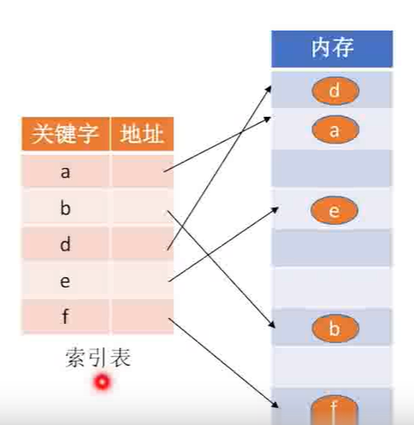
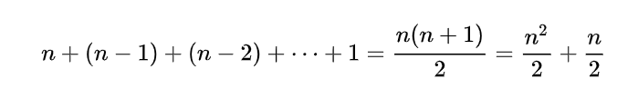
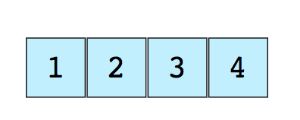

## 数据结构的基本概念？

> 数据结构是计算机存储、组织数据的方式，对于特定的数据结构（比如数组），有些操作效率很高（读某个数组元素），有些操作的效率很低（删除某个数组元素）。程序员的目标是为当前问题选择最优的数据结构。

### 为什么我们需要数据结构？

数据是程序的核心要素，因此数据结构的价值不言而喻。无论你在写什么程序，都需要和数据打交道。在不同的场景下，数据需要以 特定的方式存储，我们有不同的数据结构可以满足我们的需要。

### 数据的逻辑结构

1. 集合  

    各个元素同属一个集合，别无其他关系

2. 线性表  

   数据元素之间是一对一的关系。除了第一个元素，所有元素都有唯一前驱；除了最后一个元素，所有元素都有唯一后继。

3. 树状结构 

   数据元素之间是一对多的关系

4. 图结构

   数据元素之间是多对多的关系

### 数据的存储结构（物理结构）

1. 顺序存储

   顺序存储把逻辑上相邻的元素存储在物理位置上也相邻的存储单元中，元素之间的关系由存储单元的邻接关系来体现。

2. 链式存储

   逻辑上相邻的元素在物理位置上可以不相邻，借助指示元素存储地址的指针来表示元素之间的逻辑关系

3. 索引存储

   在存储元素信息的同时，还**建立附加的索引表**。索引表中的每项称为索引项，索引项的一般形式是（关键字，地址）

    

4. 散列存储

    根据元素的关键字直接计算出该元素的存储地址，又称哈希存储。

### 算法复杂度

> 算法的复杂性体现在运行该算法时 的占用计算机资源的多少上，计算机最重要的资源是时间（CPU）和空间（内存），因此复杂度分为时间和空间复杂度。

#### 时间复杂度

计算机运行一个算法时，程序代码**被执行的总次数**。 `T(n)=O(f(n))`

1. 时间复杂度的计算 （大O推导法）
   * 可以忽略加法常数（用1取代运行时间中的所有加法常树）
   * 与最高次项相乘的常树可忽略（只保留最高阶项）
   * 最高次项的指数大的，函数随着n的增长，结果也会变得增长得更快
   * **判断一个算法的（时间）效率时，函数中常数和其他次要项常常可以忽略，而更应该关注主项（最高阶项）的阶数**

2. 常见的时间复杂度

   

3. 举例

   ```
   int i,j;
   for ( i = 0; i < n; ++i){
       for(j = i; j < n; ++j){
           /*时间复杂度为 O(1) 的程序步骤序列 */
       }
   }
   ```

   **分析:**
   对于外循环其时间复杂度为O(n), 
   对于内循环，当i=0时，内循环值了n次，当i=1 时，执行了 n-1 次，······当 i=n-1 时，执行了 1 次。
   结果为: 

   

   根据大 O 阶推导方法，最终上述代码的时间复杂度为 ：O(n^2)

#### 空间复杂度

算法的空间复杂度**通过计算算法所的存储空间**实现即**运行完一个程序**所需内存的大小.  `S(n)=O(f(n))`

算法的时间复杂度和空间复杂度是可以**相互转化的**

1. 举例

   ```js
   int sum(int n)
   {
     int value=0;
     int ii=1;
     while(ii<=n){
       value=value+ii;
     }
     return value;
   }
   ```

   不管n怎么变，算法所需要的内存空间都是一个固定的常树，空间复杂度为 `S(n)=O(1)`


## 8中常见的数据结构

### 数组

> 数组是最简单也是最常用的数据结构，其他数据结构，比如栈和队列都是由数组衍生出来的。

下图展示了1个数组，它有4个元素



每个数据的元素的位置由数字编号，称为下标或者索引（index）。大多数编程语言的数据第一个元素的下标是0.根据维度区分有2种不同的数据：

* 一维数组
* 多维数组（数组元素是数组）

#### 数组的基本操作

1. Insert 在某个索引处插入元素
2. Get  读取某个索引处的元素
3. Delete 删除某个索引处的元素
4. Size 获取数组的长度

### 栈

> 只允许在一端进行插入或删除操作的线性表。栈中的元素采用 后进先出的规则


### 队列

### 链表

### 图

### 树

### 前缀树

### 哈希表

