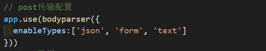
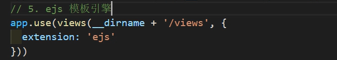
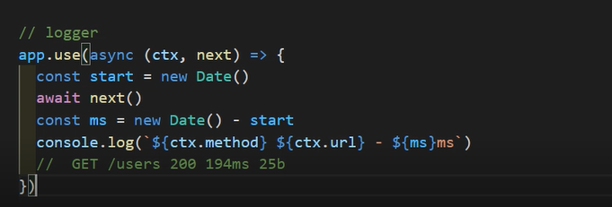
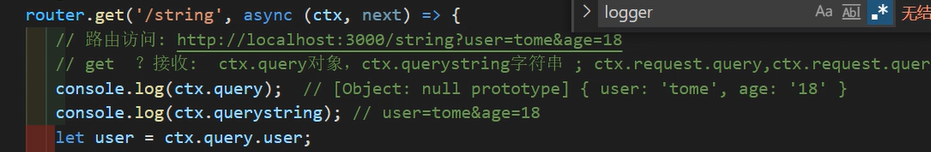
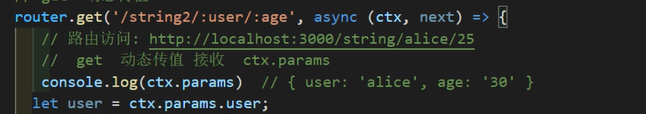

# KOA

## koa项目 app.js

post  传送模块   bodyparse 

ejs 模板引擎  安装 koa-views 和  ejs  

传输日志 logger  

前后端分离  必须是json接口 

get  ? 普通传值   用ctx.query对象来接收 

get  : 动态传值    用 ctx.params 来接收    前后端分离resetful 常用动态路由 

接收post传值  ctx.request.body