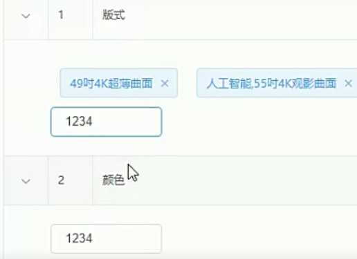

## 电商后台管理系统 

**所用技术**

* Vue + ElementUI 框架 + Mysql  
* api 接口地址 axios.defaults.baseURL = 'https://lianghj.top:8888/api/private/v1/'

### 登录组件

1. 利用element 框架 快速搭建一个 登录框    有用户名和密码 输入框    < el-form  >

   1. 采用elementui表达 自带的 rules 规则 判断输入内容 规则 是否为空  或者符合长度

   2.  ```  
       :rules="loginFormRules"
        loginFormRules: {
              username: [
                { required: true, message: '用户名不能为空', trigger: 'blur' },
                { min: 3, max: 10, message: '长度在 3 到 10 个字符', trigger: 'blur' }
              ],
               password: [
                { required: true, message: '密码不能为空', trigger: 'blur' },
                { min: 6, max: 20, message: '密码不得少于6位', trigger: 'blur' }
              ]
       ```

2. 消息提示

   1. 利用element ui 的message 组件    

      ```
       this.$message.error('登录失败！'); 
       this.$message.success('登录成功');	
       
      ```

   

3. 登录预验证 判断用户名密码正确 

   ``` 
     login () {
         this.$refs.loginFormRef.validate(async (valid) => {
           if (!valid) return
           const { data: res } = await this.$http.post('login', this.loginForm)
           if (res.meta.status !== 200) return this.$message.error('登录失败！');
           this.$message.success('登录成功');
           window.sessionStorage.setItem('token',res.data.token); // 后将token 保存到客户端的 sessionStorage 中
           this.$router.push('/home');
           
         })
       },
   ```

   

4. 登录成功之后将token 保存到客户端的 sessionStorage 中

   1. 项目中除了登录之外的其他API 接口，必须在登录之后才能访问

   2. token 只应在当前网站打开期间生效，所以将token 保存在sessionStorage 中       

      ``` 
       window.sessionStorage.setItem('token',res.data.token);
      ```

5. 通过编程时导航跳转到后台主页 ，路由地址是 /home 

6. 路由导航守卫 控制访问权限

   1. 如果用户没有登录，但是直接通过URL  访问特定页面，需要重新导航到 登录页面  

      ``` 
      router.beforeEach((to,from,next)=>{
        // to 将要访问的路径
        // from  代表从哪个路径跳转而来
        // next 是一个函数，表示放行 
        if(to.path === '/login')  return next() // 访问登录页 直接放行 
        // 获取token
        const tokenStr= window.sessionStorage.getItem('token')
        if( !tokenStr ) return next('/login') // 没有token 强制跳转到登录页 
        next()
      })
      ```

7. 退出登录  

   1. 清空 sessionStorage 中的token     

   2. 路由跳转到 /login  

      ``` 
       window.sessionStorage.clear();
       this.$router.push('/login');
      ```

      

### Home组件    

#### 左侧列表

1. 使用elemenui中的 el-menu 组件 来构建导航菜单 

2. 需要授权的 API ，必须在请求头中使用 `Authorization` 字段提供 `token` 令牌，所以要设置axios 请求拦截 ，添加 token值  

   ``` vue
   axios.interceptors.request.use(config=>{         	config.headers.Authorization=window.sessionStorage.getItem('to  ken')
         return config
   })
   
   ```

3.  创建created 生命周期 ，在页面渲染之前获取到数据

   ``` 
   created(){
           this.getMenuList()
       },
   async getMenuList(){
               const{data:res} = await  this.$http.get('menus')
               if(res.meta.status !== 200) return 	vvvv    		this.$message.error(res.meta.msg)
               this.menulist=res.data
               console.log(res);
   }
   ```

4.  在列表模板中  v-for  遍历数据 

   ``` 
   v-for="item in menulist" :key="item.id"
   <span> {{item.authName}} </span>
   ```

5. 左侧列表数据 进行美化 ，更换标题之前的 图标

6. 路由重定向，进入 home 页面后，给Main 区域添加个组件，设置到home路由的 children 中 

   ``` js
    { 
       path:'/home' , 
       component: Home ,
       redirect:'/welcome' ,
       children:[
         {
           path:'/welcome',
           component:Welcome
         }
       ]
      
     }
   ```

7. 将路由菜单改造为 路由链接  。

   * 给menu 组件 **添加 router 属性**   使用 vue-router 的模式，

   * 启用该模式会在激活导航时以 index 作为 path 进行路由跳转

   * ``` js
       <el-menu-item :index="'/'+items.path" v-for="items in item.children" :key="items.id">
     ```


#### 右侧用户列表

1. 获取用户列表  

   ``` js
   //  data中填写相关属性 
     	data() {
         return {
           // 获取用户列表的参数对象 
           queryInfo:{
             query:'',
             pagenum:1,
             pagesize:2
           },
           userlist:[],
           total:0
         }
       },
       
    // script
     created(){
         this.getUserList()
       },
       methods:{   // async 优化promise 
      async   getUserList(){
          const {data:res} =  await this.$http.get('users',{params:this.queryInfo})
           if(res.meta.status !== 200) return this.$message.error(res.meta.msg)
           console.log(res);
           this.userlist =res.data.users
           this.total=res.data.total
         }
       }
   
   ```

2. 利用 Element  table 组件  搭建 用户列表表格 

   ``` js
   // props为 数据对应的键    stripe 为 斑马纹效果 
   <el-table :data="userlist" style="width: 100%" border="1" stripe class="userCard">
               <el-table-column prop="username" label="姓名" width="180"></el-table-			   column>
   </el-table>
   // 添加索引列  1  2 3  4  index 
    <el-table-column type="index"  label="#"></el-table-column>
   							
   ```

3. 渲染用户状态 开关 

   ``` 
   作用域插槽  在父组件中使用子组件的数据了。
    <template slot-scope="scope"> <!-- 作用域插槽 -->
                      
        <el-switch
         v-model="scope.row.mg_state">
                        
       </el-switch>
   </template>
   ```

4. 分页导航条 

   ``` 
   利用element ui的  el-pagination 实现  
    <el-pagination
                   @size-change="handleSizeChange"
                   @current-change="handleCurrentChange"
                   :current-page="queryInfo.pagenum"
                   :page-sizes="[1,2,3,5,10]"
                   :page-size="queryInfo.pagesize"
                   layout="total, sizes, prev, pager, next, jumper"
                   :total="total">
     </el-pagination>
     
       // 分页 pagesize 改变的事件    拿到新数据重新携带新数据 调用用户列表api 
         handleSizeChange(newSize){
             this.queryInfo.pagesize = newSize
             this.getUserList();
         },
         handleCurrentChange(newPage){
             this.queryInfo.pagenum=newPage
             this.getUserList();
         }
         
   ```
### 用户管理

#### 添加用户

1. 导入elementUI中的dialog 对话框组件   

2. 渲染对话框添加一个表单

``` 
   // 框架    
    <el-form :model="addForm" :rules="addFormRules" ref="addFormRef" label-width="70px">
             <el-form-item label="用户名" prop="username">
               <el-input v-model="addForm.username"></el-input>
             </el-form-item>
    <el-form>
    
   // 数据绑定 
    addForm:{
             username:'',
             password:'',
             email:'',
             mobile:''
       },
   // 添加表单的验证规则 
      addFormRules:{
         username:[
           { required: true, message: '请输入用户名', trigger: 'blur' },
          {min:3,max:10,message:'用户名的长度在3-10个字符之间',trigger: 'blur'}
        ],
     }
```


3. 邮箱手机号自定义规则 

   * 邮箱正则表达式  const regEmail =/^([a-zA-Z0-P_-])+@([a-zA-Z0-9_-])+(\.[a-zA-Z0-9_-])+/_

   * 手机号正则表达式 const regEmail =/^(0|86|17951)?(13[0-9]|15[0123456789]|17[678]|18[0-9]|14[57])[0-9]{8}$/

   * 使用自定义规则 

~~~js
 export default {
     data() {
       // 验证邮箱的规则
       var checkEmail =(rule,value,cb)=>{
         const regEmail =/^([a-zA-Z0-P_-])+@([a-zA-Z0-9_-])+(\.[a-zA-Z0-9_-])+/
         if(regEmail.test(value)){
           return cb()
         }
         cb(new Error('请输入合法的邮箱'))
      }
   
 // addFormRules对象 中  
   email: [
           { required: true, message: '邮箱不能为空', trigger: 'blur',},
           { validator: checkEmail, trigger: 'blur'}
          
           ],
 ```
~~~

4. 添加用户 

   ``` js
   // 点击添加 进行 表单与验证
   // post数据 =>  重新执行获取用户列表方法 
    addUser(){
           this.$refs.addFormRef.validate(async valid=>{
              if (!valid) return
              const { data: res } = await this.$http.post('users', this.addForm)
               if (res.meta.status !== 201) return this.$message.error('添加用户失败！');
               this.$message.success('添加用户成功');
                 this.addDialogVisible=false
                 this.getUserList();
              
          })
         }
           
   ```
5. 添加用户对话框关闭事件  （清空表格）

   ``` 
    addDialogClosed(){
              this.$refs.addFormRef.resetFields() // addFormRef 表单的引用
   },
   ```

   

### 权限管理

#### 角色列表

1. 展开行 

   ``` vue
   <el-table-column type="expand"></el-table-column>
   ```

2. for三套 

   ``` vue
     <el-row :class="['bdbottom',i1===0 ? 'bdtop' : '']" v-for="(item1,i1) in scope.row.children" :key="item1.id">
                          <!-- 渲染一级权限 -->
           <el-col :span="5">
          		 <el-tag> {{item1.authName}}</el-tag>
           	 <i class="el-icon-caret-right"></i>
           </el-col>
                          	 <!-- 渲染二级三级权限 -->
            <el-col :span="19">
                 <el-row :class="['bdbottom',i2===0 ? 'bdtop' : '']"  v-for="(item2,i2) in item1.children" :key='item2.id'>
            <!-- 二级权限 -->
            <el-col :span="6">
                  <el-tag type="success">{{item2.authName}}</el-tag>
                  <i class="el-icon-caret-right"></i>
            </el-col>
                           <!-- 三级权限 -->
           <el-col :span="18">
            	 <el-tag :class="['bdbottom',i3===0 ? 'bdtop' : '']"  type="success" v-for="(item3,i3) in item2.children" :key="item3.id">{{item3.authName}}</el-tag>
            </el-col>
            </el-row>
   ```

#### 权限管理

1. 关于Tree树形控件的基本使用 

   * :props 数据源 /  show-checkbox 以复选框的形式展示 
   * default-expand-all  展开所有节点 / default-checked-keys 默认选中的节点

   ```vue
    <el-tree :data="rightsList" :props="treeProps" show-checkbox node-key="id" default-expand-all :default-checked-keys="defKeys" ref="treeRef"></el-tree>
   ```

   * 树形控件的绑定对象  

     ``` js
      treeProps:{
                     children:'children',  // 指定子树为节点对象的某个属性值
                     label: 'authName', //指定节点标签为节点对象的某个属性值
         },
     ```

2. 点击分配权限按钮，默认选中已有的权限

   * 通过递归的形式获取所有三级权限的id ，并push到 数组defKeys中，默认选中 

     ``` js
      getLeafKeys(node,arr){
                 if(!node.children){
                     return arr.push(node.id)
                 }
             
             node.children.forEach(item => {
                 this.getLeafKeys(item,arr)
             });
             },
      // 对话框取消后要把 默认的节点defkeys 清空 
             // 权限对话框的关闭事件
             setRightDialogClosed(){
                 this.defKeys=[]
             },
     ```

3. 给用户分配权限  

   * 利用tree组件的 getCheckedKeys()方法 拿到 选中的全部子节点 的key 
   * 利用tree组件的getHalfCheckedKeys()方法 拿到半选中的子节点 的key 
   * 放到一个新的数组中，并用,分割转换成字符串 ， post接口  `roles/${this.roleId}/rights`,{rids:idStr}  更新数据

   ``` js
    async  allotRights(){
               const Keys=[
                 ...this.$refs.treeRef.getCheckedKeys(),
                 ...this.$refs.treeRef.getHalfCheckedKeys()
               ]
               const idStr =Keys.join(',');
               //角色授权
          const{data:res} = await this.$http.post(`roles/${this.roleId}/rights`,{rids:idStr}) ;
           if(res.meta.status !==200 ){
               return this.$message.error('角色授权失败！')
           }
           this.$message.success('角色授权成功！');
           this.getRoleList();
           this.setRightDialogVisable= false
      }
   ```

   

### 商品管理

#### 分类参数

1. 解决 动态编辑标签  多行数据不独立而是同步输入

   * 给获取到的的数据通过遍历每一项数据都单独添加属性  inputVisible   inputValue   独立使用自己的 属性 

   * ``` js
      res.data.forEach(item => {
               item.attr_vals=item.attr_vals ? item.attr_vals.split(' ') : []
               // 控制文本框的显示与隐藏  
               item.inputValue=''
               item.inputVisible=false
          });
       
     ```

#### 商品列表

1. 自定义全局过滤器dataFormat , **格式化获取到的时间数据**

   ``` js
   //main.js 
   Vue.filter('dataFormat',function(originVal){
      const dt= new Date(originVal);
      const y =dt.getFullYear();
      const m =(dt.getMonth()+1+'').padStart(2,'0')
      const d =(dt.getDate()+'').padStart(2,'0')
   
      const hh =(dt.getHours()+'').padStart(2,'0')
      const mm =(dt.getMinutes()+'').padStart(2,'0')
      const ss =(dt.getSeconds()+'').padStart(2,'0')
      return `${y}-${m}-${d} ${hh}:${mm}:${ss}`
   })
   // 在组件中使用
    <el-table-column label="创建时间">
             <template slot-scope="scope">
               {{ scope.row.add_time | dataFormat }}
             </template>
    </el-table-column>
   ```

   

2.  upload组件上传图片 解决 无效token问题 

   ```vue
   // 解决方法  
   //  在请求头携带token
   1. 在upload组件中定义 header 属性 :headers="headerObj" 
    <el-upload
                   
                   action="https://lianghj.top:8888/api/private/v1/upload"
                   :headers="headerObj" 
                   :on-preview="handlePreview"
                   :on-remove="handleRemove"
                   :file-list="fileList"
                   :on-success="handleSuccess"
                   list-type="picture">
                   <el-button size="small" type="primary">点击上传</el-button>
                   
    </el-upload>
    2. 双向绑定 token值
     headerObj:{
           Authorization:window.sessionStorage.getItem('token')
     },
   ```

3. 上传的图片 进行 移除图片事件 

   ``` js
   //1.获取将要删除的图片的临时路径
   //2.从pics 数组中，找到这个图片对应的索引值
   //3.调用数组的splice 方法， 把图片信息对象，从pics数组中移除
   
   handleRemove(file){
       const filePath = file.response.data.tmp_path
       const i= this.addForm.pics.findIndex(x=>x.pic=== filePath)
       this.addForm.pics.splice(i,1)
       console.log(this.addForm);
     },
   ```

4. **富文本编辑器** 

   1. 安装富文本编辑器 依赖   > npm install vue-quill-editor --save 

   2. 定义全局 

      ``` js
      import Vue from 'vue'
      import VueQuillEditor from 'vue-quill-editor'
      
      import 'quill/dist/quill.core.css' // import styles
      import 'quill/dist/quill.snow.css' // for snow theme
      import 'quill/dist/quill.bubble.css' // for bubble theme
      ```

   3. 使用 

      ``` vue
       <quill-editor
             v-model="addForm.goods_introduce"   
         >
        </quill-editor>
      ```

4. 添加商品时涉及到了 双向绑定 值类型的转换问题 

   * 采用深拷贝方法单独 拷贝出一分新的 表单数据 用于Post提交 

   * 方法  ：npm i lodash --save   

     ````js
     1. 导入 
     <script>
     import _ from 'lodash'
     2. 深拷贝操作 
     const form = _.cloneDeep(this.addForm)
     ````

### 数据统计

#### Echarts图表

1.  官网 https://echarts.apache.org/zh/index.html  

2. 在Vue 项目中使用 

   ``` 
   1. 导入 echarts  
   import echarts from 'echarts'
   2. <!-- 为 ECharts 准备一个具备大小（宽高）的 DOM -->
   <div id="main" style="width: 600px;height:400px;"></div>
   3.基于准备好的dom，初始化echarts实例
    var myChart = echarts.init(document.getElementById('main'));
   4. api获取数据 渲染  
    const {data:res} = await this.$http.get('reports/type/1');
           if(res.meta.status!==200){
             return  this.$message.error('获取用户数据失败！')
           }
   myChart.setOption(res.data);
   ```

   


### 常用代码块

#### element UI

1. this.$message.error('获取父级分类数据失败！')

2. this.$refs.addFormRef.resetFields() ; 

3. 表单验证规则

   ```
    addFormRules:{
            attr_name:[
               { required: true, message: '请输入属性名称', trigger: 'blur' },
               {min:3,max:10,message:'参数名称在3-10个字符之间',trigger: 'blur'}
             ],
      }
   ```

4. 提交表单前的预验证

   ``` 
   this.$refs.editFormRef.validate(async valid=>{
               if(!valid) return
            const{data:res} =await  					       this.$http.put(`categories/${this.cateId}/attributes/${this.editForm.attr_id}`,{
                 attr_name:this.editForm.attr_name,
                 attr_sel:this.activeName
               });
           if(res.meta.status!==200){
            return   this.$message.error('修改参数失败！')
           }
             this.$message.success('修改参数成功！')   
               this.editParamsDialogVisible=false ;
                this.getParamsData(); 
          })
   ```

   


