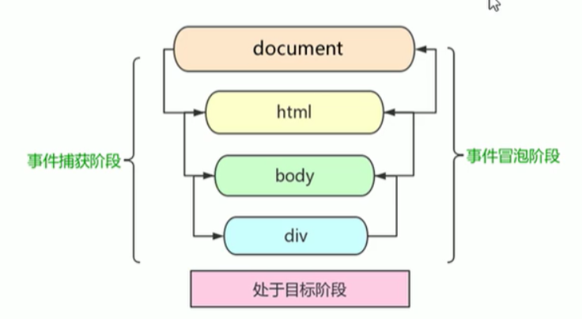
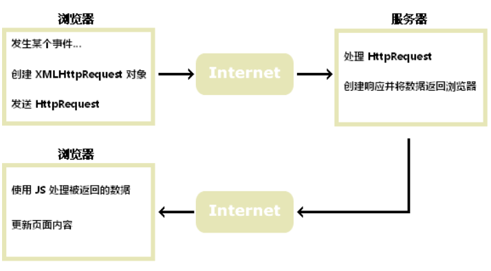
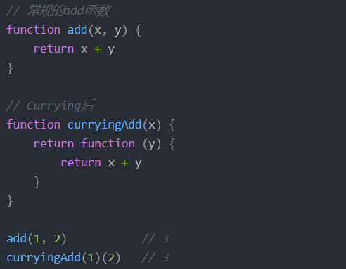

## HTML

1. 说说title和alt属性

   两个属性都是当鼠标滑动到元素上的时候显示的，alt是 img 的 特有属性，图片无法正常显示时候替代的文字。 而title属性 是对 dom 元素的一种类似注释说明 

2. HTML5新增的特性

   * 绘画 canvas
   * 用于媒介回放的 video 和 audio 元素
   * 本地离线存储 localStorage 关闭浏览器后数据不丢失， sessionStorage 浏览器关闭后数据清除 
   * 语义化更好的内容元素 ，如 article  footer  header  nav ..
   * 表单控件  calendar  date  time email  
   * 新的技术 webworker  webScoket 

3. HTML W3C 标准

   标签闭合、标签小写、不乱嵌套、使用外链 css和 js 、结构行为表现的分离


## CSS

1. 设置盒子居中的几种方式

   * Margin 

     ```
     div{
     	width:100px;
     	height:100px;
     	margin:0 auto; 
     }
     
     ```

   * 利用定位让盒子水平垂直居中

     ```
     <div class="parent">
         <div class="child">
     
         </div>
     </div>
     
     .parent {
         background-color: #eee;
         width: 500px;
         height: 500px;
         margin: 10px auto;
         position: relative;
     }
     
     .child {
         width: 200px;
         height: 200px;
         background-color: lightcoral;
         position: absolute;
         top: 50%;
         left: 50%;
         transform: translate(-50%, -50%);
     
     ```

   * 利用flex布局实现盒子水平处置居中

     ```
     <style>
     	.box{
             border: 1px red solid;
             width: 100px;
             height: 100px;
             display:flex;
             justify-content: center;
             align-items: center;
         }
         .box1{
     		width:50px;
     		height:50px;
     		border:1px red solid;
     	}
     </style>
     <body>
     	<div class="box">
     	 <div class="box1"></div>
     	 </div>
     </body>
     
     ```

2. flex布局中，flex:1; 是什么作用？

   让所有弹性盒模型对象的子元素都有**相同的长度**，且忽略它们内部的内容：

   ```
   <style> 
   #main
   {
   	width:220px;
   	height:300px;
   	border:1px solid black;
   	display:flex;
   }
   
   #main div
   {
   	flex:1;
   }
   </style>
   </head>
   <body>
   
   <div id="main">
     <div style="background-color:coral;">红色</div>
     <div style="background-color:lightblue;">蓝色</div>  
     <div style="background-color:lightgreen;">带有更多内容的绿色 div</div>
   </div>
   ```

3. link和 @import 的区别

   * link是html方式， @import 是 css方式
   * link优先级要比 @import 高
   * @import  必须在样式规则 之前， 可以在css文件中引用其他文件 

4. 清除浮动的几种方式

   * 父级div 定义 height 
   * 结尾处加空 div 标签 clear : both 
   * 父级 div 定义伪类 :after 和 zoom
   * 父级div定义 overflow:hidden
   * 父级div也浮动，需要定义宽度
   * 结尾处加br 标签 clear : both 

5. display: inline-block 与  inline  block  的区别 
   * 与inline相比，display: inline-block 允许在元素上设置宽度和高度, 将保留上下外边距/内边距
   * 与 display: block 相比，主要区别在于 display：inline-block 在元素之后不添加换行符，因此该元素可以位于其他元素旁边。

6. CSS权重

   * ！important > 内联样式 style  > ID > 类属性、属性选择器或者伪类选择器 > 标签选择器

7. sass 、less是什么 ？
   * 他们是CSS预处理器，
   *  less 是一种**动态样式语言**，将 css 赋予了动态语言的特性，如变量、继承、运算、函数，LESS 既可以 在客户端上运行，也可在服务端运行。
* 变量符不一样 ，less是 @ ， 而sass是 $
   * sass支持 条件语句，可以使用 if else for 循环等等。而Less不支持。
   * 结构清晰，便于扩展。完全兼容 CSS 代码，可以方便地应用到老项目中。
   
8. px和 em  rem 的区别

   * px和em都是长度单位，px值固定，相对于**显示器屏幕分辨率**而言。em值不固定，是相对单位，其**相对应父级元素的字体**大小而言。
   * rem 相对单位，**相对的只是HTML根元素**，既可以做到只修改根元素就成比例地调整所有字体大小，又可以避免字体大小逐层复合的连锁反应。如果不设置根元素的字体大小，则会默认以根元素的16px的大小计算值。

9. 重排和重绘 
   * 部分渲染树（或者整个渲染树）需要重新分析并且节点尺寸需要重新计算。这被称为重排。
     由于节点的几何属性发生改变或者由于样式发生改变，例如改变元素背景色时，屏幕上的部分内容需要更新。这样的更新被称为重绘。

10. 什么情况会触发重排和重绘？
   * 添加、删除、更新DOM 节点  
   * 通过 display: none 隐藏一个 DOM节点   - 触发重排和重绘
   * 通过 visibility:hidden 隐藏一个DOM 节点  -  触发 重绘
   * 移动或者给 页面中的DOM 节点添加动画
   * 添加一个样式表，调整样式属性
   * 用户行为，例如调整窗口大小，改变字号，或者滚动

11. 什么是BFC? BFC的布局规则是什么？如何创建BFC？BFC应用？

    > BFC(block formatting context ) 块级格式化上下文，他是一个独立的渲染区域，只有block-level box参与，它规定了内部的BLOCK-LEVEL BOX 如何布局，并于这个区域外部毫不相干

    **Box ：** css布局的基本单位，直观点说就是一个页面是由很多个Box组成的，元素的类型和display属性 ，决定了这个 box的类型  。 不同类型的Box，会参与不同的  Formatting Context . 

    block-level  box ： display属性为 block .list-item,table 的元素，会生成 block-level box , 并且参与blockd fomatting context ;

    inline-level box : display 属性为 inline , inline-block , inline-table 的元素，会生成 inline-level box. 并且参与 inline formatting context 

    **Formatting Context :** 它是页面中的一块 渲染区域，并且有一套渲染规则 ，它决定了其子元素将如何定位，以及和其他元素的关系和相互作用。最常见的 Formatting context 有 block formatting context  和 inline formatting context 

    **BFC的布局规则 :** 

    * 内部的Box会在垂直方向，一个接一个的放置。
    * box垂直方向的距离由 margin 决定， 属于同一个BFC 的两个 相邻 box的 margin会发生重叠。
    * 每个盒子（块盒与行盒）的margin box的左边，与包含块border box的左边相接触(对于从左往右的格式化，否则相反)。即使存在浮动也是如此。
    * BFC的区域不会与float box重叠。
    * BFC就是页面上的一个隔离的独立容器，容器里面的子元素不会影响到外面的元素。反之也如此。计算BFC的高度时，浮动元素也参与计算。

    **如何创建BFC?**  

    * float的值不是none。
    * position的值不是static或者relative。
    * display的值是inline-block、table-cell、flex、table-caption或者inline-flex
    * overflow的值不是visible

    **实例：**

    * 两个P元素 同时设置margin，会发生margin重叠 ，我们只需要给第二个P元素 加个 div  并且 设置 overflow:hidden 即可 。
    * 实现自适应布局 ，也可以给 右边的盒子 加 overflow:hidden  
    * 清除浮动 同理 。

## Javascript

1. 说几条 JavaScript 的基本规范
   * 不要在同一行声明多个变量
   * 请使用 === / !==  来比较 true/false 或者数值
   * 使用对象字面量替代  new Array 这种形式 
   * 不要使用全局函数
   * Switch 语句 必须带有default 分支 
   * IF 语句 必须使用大括号  
   * for-in 循环中的变量应该使用 let 关键字 明确限定作用域，从而避免作用域污染  
   
2. 闭包
   * **指有权访问另一个函数作用域中变量的函数** ，最常见的方式是 在一个函数内创建另一个函数，通过另一个函数访问这个函数的局部变量，利用闭包可以实现作用域链 
   * 闭包的特性
     * 函数内再嵌套函数
     * 内部函数可以引用外层的参数和变量
     * 参数和变量不会被垃圾回收机制回收
   * 优点 ： 能够实现缓存和封装 
   * 缺点 : 消耗内存，使用不当会内存溢出 

3. 说说你对作用域链的理解
   
   * 作用域链的作用是 **保证 执行 环境里有权访问的变量 和函数是有序的，**作用域链的变量只能向上访问，变量访问到 window 对象即被终止，作用域链向下访问变量是不被允许的。
   
4. JavaScript 原型prototype   __ proto __
   * 每一个构造函数都有一个 prototype属性，也称为原型对象，构造函数中共有的方法都在存在这个对象中，从而所有实例对象都可以共用这个方法。  
   * 每一个对象都有一个 __ proto __ 属性， 指向构造函数中的prototype ，所以实例对象可以访问 构造函数中 prototype 属性中的方法  
   
5. 什么是事件委托？（事件代理）

   * 不是每个子节点单独设置事件监听器，而是事件监听器设置在其父节点上，然后利用**冒泡原理**影响设置每个子节点
   * 如 在table 上代理所有 td 的 click  事件， 提高性能

6. 谈谈你对this的理解  

   * 全局作用域、箭头函数中的this、定时器、普通函数中 this 都指向window
   * 方法调用中谁用this指向谁
   * 构造函数中this 指向构造函数的实例
   * 对象的方法中 this 指向对象 

7. 事件模型

   * w3c 中定义事件的发生经历三个阶段： 捕获阶段 、目标阶段、冒泡阶段
* 阻止冒泡： 使用stopPropagation( ) 方法
   * 阻止捕获： 阻止事件的默认行为，例如click  a链接后的跳转。 使用 preventDefault（ ） 方法 
   
8. Ajax原理 

   > AJAX 是一种在无需重新加载整个网页的情况下，能够更新部分网页的技术。

   Ajax 的原理简单来说是在用户和服务器之间加了—个中间层( AJAX 引擎)，通过 XmlHttpRequest
   对象来向服务器发异步请求，从服务器获得数据，然后用 javascript 来操作 DOM 而更新页面。



9. 原生ajax 过程实现 ：
   
   * 创建XMLHttpRequest 对象
   * 调用 open 方法 传入三个参数 （get/post , url , 同步/异步）
   * 监听 onreadystatechange 事件，当readystate等于4时返回 responseText 
   * 调用send ( [string] )  方法 传递参数  ，string 只能传递post 数据 同时要设置 请求头 
   
10. Ajax解决浏览器缓存问题

   * 在ajax发送请求前加上 anyAjaxObj.setRequestHeader("If-Modified-Since","0")。
   * 在ajax发送请求前加上 anyAjaxObj.setRequestHeader("Cache-Control","no-cache")。
   * 在URL后面加上一个随机数： "fresh=" + Math.random()。
   * 在URL后面加上时间搓："nowtime=" + new Date().getTime()

11. ajax axios 和  fetch 的区别 ？

    axios 本质上对  原生ajax进行  primise 的封装，符合最新的ES规范通过 .then 来返回成功的结果，.catch来接收失败的结果 。具有以下特征：  提供了一些并发请求的接口、拦截请求和响应、自动转换JSON数据 

    ```js
    axios({
    	method: 'post', url: '/user/12345', data: {
    	firstName: 'Fred',
    	lastName: 'Flintstone' }
     })
    .then(function (response) {
    	console.log(response);
    })
    .catch(function (error) {
    	console.log(error);
    });
    ```

    fetch  同样使用了ES6中的promise 对象。fetch不是ajax的进一步封装，而是原生js，没有使用 XMLHTTPRrequest对象  。

    ```
    try {
    	let response = await fetch(url);
    	let data = response.json();
    	console.log(data);
    } catch(e) {
    	console.log("Oops, error", e);221
    }
    
    // 基本语法 
    fetch('http://example.com/movies.json')
      .then(function(response) {
        return response.json();
      })
      .then(function(myJson) {
        console.log(myJson);
      });
    最简单的用法是只提供一个参数用来指明想 fetch() 到的资源路径，然后返回一个包含响应结果的promise（一个 Response 对象）。
    ```

    

12. js的 基础数据类型 / 引用数据类型 

    基本数据类型

    * undefined  未被初始化的变量都有默认值undefined
    * null    代表变量有值，但是是一个空值 
    * Boolean 布尔型    true/false
    * Number   
    * String 
    * Symbol   符号型   唯一的并且是不可修改用来定义独一无二的对象属性名

    引用数据类型

    * Object
    * Array
    * Date
    * Function 

    补充 ： 基本数据类型的数据是直接保存在栈Stack中，而引用数据类型的数据存储在堆heap中，栈内存是系统自动分配空间的，而堆是由程序员分配释放的，用完以后要记得销毁，以免内存滥用 

13. 谈谈你对 AMD 和 Commonjs的理解
    * Amd 和  Commonjs 都是为了实现模块化编程而出现的‘
    * Commonjs **同步加载 适用于服务器端，** Node就是采用这种模式，它是同步加载不同模块文件
    * Amd （Asynchronous Module Definition）**异步模块定义，适用于 浏览器端，**浏览器需要使用的js文件都存放在服务器端，从服务器端加载文件到浏览器是受网速等各种环境因素的影响的，如果采用同步加载方式，一旦js文件加载受阻，后续在排队等待执行的js语句将执行出错，会导致页面的‘假死’，用户无法使用一些交互。所以在浏览器端是无法使用CommonJS的模式的。

14. 介绍js有哪些内置对象 ？
    * Object 是 javascript 中所有对象的父对象 
    * 数据封装对象 ： Object 、Array、Boolean 、number 、String
    * 其他对象: Function 、Arguments 、Math 、Date 、RegExp、Error 

15. 谈谈你对ES6的理解
    * 新增模板字符串  ${ }
    * 箭头函数  this指向window
    * for-of 用来遍历数据- 例如数组中的值
    * arguments 对象可被 不定参数 和默认参数完美代替
    * ES6 将 promise 对象纳入规范，提供了原生的 Promise 对象。
    * 增加了let 和 const 命令， 用来声明变量
    * 引入了 module 模块的概念 

16. sort  快速打乱数组

    ```
     let arr =[1,2,3,4,5,6,7,8,9];
            arr.sort(()=>{
              return  Math.random() - 0.5
              //利用 sort  return 大于 等于0 不交换位置，小于0 交换位置 
            })
      console.log(arr); [8,9,4,6,1,5,2,3,7]
    ```

17. 跨域问题

    > 跨域产生的原因：浏览器受到同源策略的限制，在不同域名、不同端口、不同协议等情况下不允许资源共享。

    解决跨越的方法：

    * jsonp 

      通常为了减轻web服务器的负载，我们把js、css，img等静态资源分离到另一台独立域名的服务器上，在html页面中再通过相应的标签从不同域名下加载静态资源，而被浏览器允许，基于此原理，我们可以通过动态创建script，再请求一个带参网址实现跨域通信。只适用于get请求 方式 

    * CORS 请求 （设置后端请求头）

       浏览器一旦发现ajax请求跨越，就会加一些附加请求头

      ```
       header(Access-control-Allow-Origin:  * ');   
      //*代表允许访问的来源（所有），但是你在请求头携带cookie等东西时，必须要指明，也就是设置跨域白名单。
       
      header('Access-control-Allow-Method: POST,GET');  //允许访问的方式
      
      ```

    * 设置代理

      客户端发送请求时，不直接到服务器，而是先到代理的中间层，同理，当服务器返回数据时，先到代理的中间层。

    * Nginx  反向代理 

      安装 nginx ，配置location ，前端的地址和后端的地址**用nginx转发到同一个地址**下，如5500端口和3000端口都转到3003端口下

18. 如何改变普通函数里的this指向问题？
    * call( )   调用函数 + 改变this指向
    * apply( )   参数是数组  
    * bind( )   不调用函数 + 改变this 指向  

19. var、let、const 的区别

    * var 定义的变量，没有块的概念，可以跨块访问，不能跨函数访问。可以实现变量提升在他的作用域内

    * let 定义的变量，只能在块作用域里访问，不能跨块访问  

    * const用来定义常量，使用时必须初始化(即必须赋值)，只能在块作用域里访问，而且不能修改。

    * **const定义的对象属性是可以改变的**  const仅能保证指针不发生变化，修改对象的属性不会发生改变指针，所以是被允许的

      ```
       const person = {
           name : 'jiuke',
           sex : '男'
       }
      person.name = 'test'
       console.log(person.name) // test 
      ```

20. 节流防抖

    * 防抖和节流的作用都是防止函数多次调用，

    * 节流：**每隔一段时间执行一次**，通常用在高频率触发的地方，降低频率。如鼠标滑动、拖拽

      ```
      //定义：当持续触发事件时，保证隔间时间触发一次事件。
      //1. 懒加载、滚动加载、加载更多或监听滚动条位置；
      //2. 百度搜索框，搜索联想功能；
      //3. 防止高频点击提交，防止表单重复提交；
      function throttle(fn,wait){
          let pre = 0;
          return function(...args){
              let now = Date.now();
              if( now - pre >= wait){
                  fn.apply(this,args);
                  pre = now;
              }
          }
      }
      function handle(){
          console.log(Math.random());
      }
      window.addEventListener("mousemove",throttle(handle,1000));
      ```

      

    * 防抖：**一段时间内连续触发，不执行。直到超出限定时间执行最后一次。** 如 input模糊搜索 ，以及用户输入 ， 只需要在输入完成后做一次输入校验即可。 

      ```
      //定义：触发事件后在n秒内函数只能执行一次，如果在n秒内又触发了事件，则会重新计算函数执行时间。
      //搜索框搜索输入。只需用户最后一次输入完，再发送请求
      //手机号、邮箱验证输入检测 onchange oninput事件
      //窗口大小Resize。只需窗口调整完成后，计算窗口大小。防止重复渲染。
      const debounce = (fn, wait, immediate) => {
            let timer = null;
            return function (...args) {
              if (timer) clearTimeout(timer);
              if (immediate && !timer) {
                fn.call(this, args);
              }
              timer = setTimeout(() => {
                fn.call(this, args);
              }, wait);
            };
          };
      const betterFn = debounce(() => console.log("fn 防抖执行了"), 1000, true);
      document.addEventListener("scroll", betterFn);
      ```

      

21. 如何理解前端模块化

    前端模块化就是复杂 的文件编程一个一个独立的模块，比如js文件等等，分成独立的模块有利于重用和维护，这样会引来模块之间相互依赖的问题，所以有了commonJS规范，AMD、CMD规范等等，以及用于js打包的工具  webpack 

22. 说说EventLoop 

    也叫事件循环，是指浏览器或Node环境的一种解决javascript 单线程运行时不会阻塞的一种机制，也就是实现异步的原理。

    首先， js 是单线程的，主要的任务是处理用户的交互，而用户的交互无非就 是响应 DOM 的增删
    改，使用事件队列的形式，一次事件循环只处理一个事件 响应，使得脚本执行相对连续，所以有
    了事件队列，用来储存待执行的事件， 那么事件队列的事件从哪里被 push 进来的呢。那就是另
    外一个线程叫事件触 发线程做的事情了，他的作用主要是在定时触发器线程、异步 HTTP 请求线
    程 满足特定条件下的回调函数 push 到事件队列中，等待 js 引擎空闲的时候去 执行，当然 js
    引擎执行过程中有优先级之分，首先 js 引擎在一次事件循环中， 会先执行js线程的主任务，然后
    会去查找是否有微任务 microtask（promise） ，如果有那就优先执行微任务，如果没有，在去
    查找 宏任务 macrotask（setTimeout、setInterval） 进行执行

23. 作用域链

    在执行上下文中访问到父级甚至全局的变量，是作用域链的作用。

    作用域链可以理解为一组对象列表，包含父级和自身的变量对象，因此我们可以通过作用域链访问到父级里声明的变量或者函数 。

    由两部分组成：[[scope]] 属性： 指向父级变量对象和作用域链 ，也就是包含了父级的[[scope]] 和 AO ,   和AO  自身活动对象  （当变量对象所处的上下文为 active EC 时，称为活动对象）

24. AST 

    抽象语法树 （Abstract Syntax Tree)   是将代码逐字母解析成 树状对象 的形式。这是语言之间 的转换、代码语法检查，代码风格检查，代码格式化，代码高亮，代码错误提示，代码自动补全等等的基础 。

25. babel 编译原理
    * **Parse(解析)**：将源代码转换成更加抽象的表示方法（例如抽象语法树）
    * **Transform(转换)**：对（抽象语法树）做一些特殊处理，让它符合编译器的期望
    * **Generate(代码生成)**：将第二步经过转换过的（抽象语法树）生成新的代码

26. 图片的懒加载和预加载

    预加载：提前加载图片，当用户需要查看时可直接从本地缓存中渲染

    懒加载：主要目的就是作为服务器前端的优化，减少请求数/延迟请求  ，减轻服务器压力

27. mouseover 和 mouseenter 的区别 
    * mouseenter  鼠标移动到元素上时触发 只会触发自身盒子  因为不会冒泡 。 同样和 mouseleave 搭配使用
    * mouseover    鼠标经过自身盒子 以及 子盒子都会触发   与 mouseout 搭配使用   

28. clientHeight,scrollHeight,offsetHeight , 以 及 scrollTop,offsetTop,clientTop 的区别？
    * clientHeight: 表示可视区域的高度，不包含border 和  滚动条  
    * offsetHeight : 表示可视区域的高度，包含了border 和 滚动条 
    * scrollHeight : 表示了所有区域 的高度，包含了因为滚动被隐藏的部分 
    * clientTop ： 表示边框border的厚度，在未指定的情况下一般为0
    * scrollTop  : 滚动后被隐藏的高度 

29. eval是做什么 ？

    eval（string）函数可以计算某个字符串，并执行其中的javascript代码 。

    ```
    eval("x=10;y=10;document.write(x*y)")
    // 100
    ```

30. 性能优化

    * 减少HTTP 请求
    * 使用内容发布网络 （CDN）
    * 添加本地缓存
    * 压缩资源文件
    * 将CSS 样式表 放在顶部，把javascript 放在底部  
    * 避免使用CSS 表达式
    * 减少DNS查询
    * 使用外部 javascript 和 css
    * 避免重定向
    * 图片 lazyLoad 

31. Virtual DOM 作用是什么？

    Virtual DOM 其实就是一棵以 JavaScript 对象( VNode 节点)作为基础的树，用对象属性来描述节点，实际上它只是一层对真实 DOM 的抽象。最终可以通过一系列操作使这棵树映射到真实环境上。原生DOM操作的运行速度 远没有 javascript的运算速度快，因此，把大量的DOM操作搬运到Javascript中，运用patching算法来计算出真正需要更新的节点，最大限度地减少DOM操作，从而显著提高性能。

    其实**虚拟DOM在Vue.js主要做了两件事：**

    * 提供与真实DOM节点所对应的虚拟节点vnode
    * 将虚拟节点vnode和旧虚拟节点oldVnode进行对比，然后更新视图
      

32. 简单介绍一下 promise 

    Promise是一个对象，保存着未来将要结束的事件，他有两个特征：

    * 对象的状态不受外部影响，Promise对象代表一个异步操作，有三种状态，pending 进行中，fulfilled已成功，rejected已失败 ，**只有异步操作的结果才可以决定当前是哪一种状态**，任何其他操作都无法改变这个状态。
    * 一旦状态改变，就不会再变，promise 对象状态改变只有两种可能，从 pending
      改到 fulfilled 或者从 pending 改到 rejected，只要这两种情况发生，状态就凝固了，不会再改变，这个时候就称为定型 resolved,

33. 判断数据类型的方法  

   * typeof     缺点  typeof null 的值也是 object ，无法分辨是null 还是 object 

   * instanceof   缺点：只能判断是否是对象

   * constructor   所有对象都会从它的原型上继承一个 `constructor` 属性：  

     ``` 
     var o = {};
     o.constructor === Object; // true
     
     var o = new Object;
     o.constructor === Object; // true
     
     var a = [];
     a.constructor === Array; // true
     
     var a = new Array;
     a.constructor === Array // true
     
     var n = new Number(3);
     n.constructor === Number; // true
     ```

     

   * Object.prototype.toString.call( )   最好的检测方式  

32. 对象深拷贝与浅拷贝

    ```
    //浅拷贝 
    1. Object.assign(target,source)
    2. es6对象扩展运算符。
    //深拷贝    
    function deepClone(obj) {
          if (!obj || typeof obj !== "object") return;
          let newObj = Array.isArray(obj) ? [] : {};
          for (let key in obj) {
            if (obj.hasOwnProperty(key)) {
              newObj[key] = typeof obj[key] === "object" ? deepClone(obj[key]) : obj[key];
            }
          }
          return newObj;
    }
    
    ```

33. 数组扁平化

    ```
    function flatten(arr) {
          return arr.reduce((result, item) => {
            return result.concat(Array.isArray(item) ? flatten(item) : item);
          }, []);
    }
    ```

34. JS函数柯里化

    将多变量函数拆解为单变量的多个函数的依次调用,可以从高元函数动态地生成批量的低元的函数。简单讲：只传递给函数一部分参数来调用它，让它返回一个函数去处理剩下的参数。你可以一次性地调用 curry 函数，也可以每次只传一个参数分多次调用。

    

    作用：
    
    * 参数复用
    * 提前返回
    * 延迟运行

35. get 请求传参长度的误区 

    误区：get请求参数的大小存在限制，而post请求的参数大小是无限制的。

    实际上HTTP协议未规定 get 和 post 的请求长度是多少，给get请求参数的限制是来源于浏览器 或web服务器。 **浏览器或web服务器限制了url长度。**

36. 如何判断一段脚本是运行在浏览器上还是服务器上 ？

    根据浏览器的独有全局属性 **window  document  xmlHttpRequest** 等 进行 判断，如果不等于 undefined  则表示运行在 浏览器上 。  根据服务器的独有全局属性 **process** 来判断是否在 服务器上 。