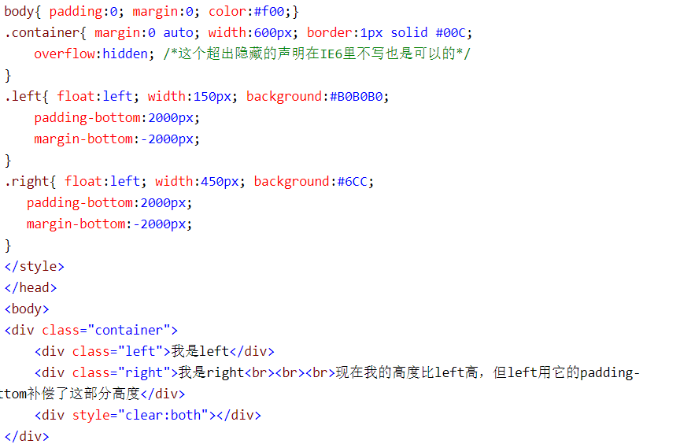
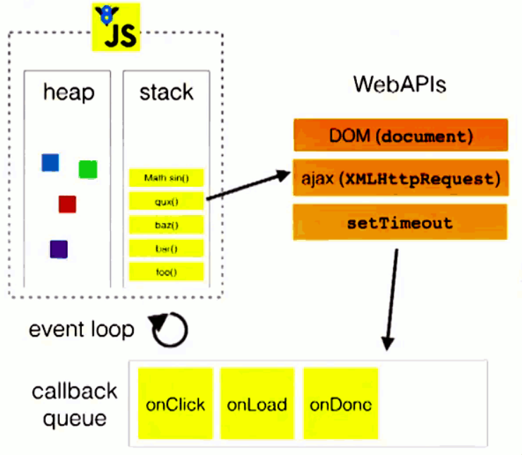

## HTML

1. 说说title和alt属性

   两个属性都是当鼠标滑动到元素上的时候显示的，alt是 img 的 特有属性，图片无法正常显示时候替代的文字。 而title属性 是对 dom 元素的一种类似注释说明 

2. HTML5新增的特性

   * 绘画 canvas
   * 用于媒介回放的 video 和 audio 元素
   * 本地离线存储 localStorage 关闭浏览器后数据不丢失， sessionStorage 浏览器关闭后数据清除 
   * 语义化更好的内容元素 ，如 article  footer  header  nav ..
   * 表单控件  calendar  date  time email  
   * 新的技术 webworker  webScoket 

3. HTML W3C 标准

   标签闭合、标签小写、不乱嵌套、使用外链 css和 js 、结构行为表现的分离

4. document.write( ) 和 innerHTML 的区别 

    document.write是直接将内容写入页面的内容流，会导致页面全部重绘；

   innerHTML 将内容写入某个DOM节点，不会导致页面全部重绘。


## CSS

1. 设置盒子居中的几种方式

   * Margin 

     ```
     div{
     	width:100px;
     	height:100px;
     	margin:0 auto; 
     }
     
     ```

   * 利用定位让盒子水平垂直居中

     ```
     <div class="parent">
         <div class="child">
     
         </div>
     </div>
     
     .parent {
         background-color: #eee;
         width: 500px;
         height: 500px;
         margin: 10px auto;
         position: relative;
     }
     
     .child {
         width: 200px;
         height: 200px;
         background-color: lightcoral;
         position: absolute;
         top: 50%;
         left: 50%;
         transform: translate(-50%, -50%);
     
     ```

   * 利用flex布局实现盒子水平处置居中

     ```
     <style>
     	.box{
             border: 1px red solid;
             width: 100px;
             height: 100px;
             display:flex;
             justify-content: center;
             align-items: center;
         }
         .box1{
     		width:50px;
     		height:50px;
     		border:1px red solid;
     	}
     </style>
     <body>
     	<div class="box">
     	 <div class="box1"></div>
     	 </div>
     </body>
     
     ```

2. flex布局中，flex:1; 是什么作用？

   让所有弹性盒模型对象的子元素都有**相同的长度**，且忽略它们内部的内容：

   ```
   <style> 
   #main
   {
   	width:220px;
   	height:300px;
   	border:1px solid black;
   	display:flex;
   }
   
   #main div
   {
   	flex:1;
   }
   </style>
   </head>
   <body>
   
   <div id="main">
     <div style="background-color:coral;">红色</div>
     <div style="background-color:lightblue;">蓝色</div>  
     <div style="background-color:lightgreen;">带有更多内容的绿色 div</div>
   </div>
   ```

3. CSS3新特性举几个列子

   * 可以创建圆角边框
   * box-shadow 属性 添加阴影  
   * background-image 背景图片 background-size 、背景线性渐变
   * transition  animation 过渡动画 

4. link和 @import 的区别

   * link是html方式， @import 是 css方式
   * link优先级要比 @import 高
   * @import  必须在样式规则 之前， 可以在css文件中引用其他文件 

5. 清除浮动的几种方式

   * 父级div 定义 height 
   * 结尾处加空 div 标签 clear : both 
   * 父级 div 定义伪类 :after 和 zoom:1
   * 父级div定义 overflow:hidden

6. display: inline-block 与  inline  block  的区别 
   * 与inline相比，display: inline-block 允许在元素上设置宽度和高度, 将保留上下外边距/内边距
   * 与 display: block 相比，主要区别在于 display：inline-block 在元素之后不添加换行符，因此该元素可以位于其他元素旁边。

7. CSS权重

   * ！important > 内联样式 style  > ID > 类属性、属性选择器或者伪类选择器 > 标签选择器

8. sass 、less是什么 ？
   * 他们是**CSS预处理器**，
   * less 是一种**动态样式语言**，将 css 赋予了动态语言的特性，如变量、继承、运算、函数，LESS 既可以 在客户端上运行，也可在服务端运行。
     * 变量符不一样 ，less是 @ ， 而sass是 $
     * sass支持 条件语句，可以使用 if else for 循环等等。而Less不支持。
     * 结构清晰，便于扩展。完全兼容 CSS 代码，可以方便地应用到老项目中。

9. px和 em  rem 的区别

   * px和em都是长度单位，px值固定，相对于**显示器屏幕分辨率**而言。em值不固定，是相对单位，其**相对应父级元素的字体**大小而言。
   * rem 相对单位，**相对的只是HTML根元素**，既可以做到只修改根元素就成比例地调整所有字体大小，又可以避免字体大小逐层复合的连锁反应。如果不设置根元素的字体大小，则会默认以根元素的16px的大小计算值。

10. 重排和重绘 
   * 部分渲染树（或者整个渲染树）需要重新分析并且节点尺寸需要重新计算。这被称为重排。
     由于节点的几何属性发生改变或者由于样式发生改变，例如改变元素背景色时，屏幕上的部分内容需要更新。这样的更新被称为重绘。

11. 什么情况会触发重排和重绘？
   * 添加、删除、更新DOM 节点  
   * 通过 display: none 隐藏一个 DOM节点   **- 触发重排和重绘**
   * 通过 visibility:hidden 隐藏一个DOM 节点  -  **触发 重绘**
   * 移动或者给 页面中的DOM 节点添加动画
   * 添加一个样式表，调整样式属性
   * 用户行为，例如调整窗口大小，改变字号，或者滚动

11. 什么是BFC? BFC的布局规则是什么？如何创建BFC？BFC应用？

    > BFC(block formatting context ) 块级格式化上下文，他是一个独立的渲染区域，只有block-level box参与，它规定了内部的BLOCK-LEVEL BOX 如何布局，并于这个区域外部毫不相干

    **Box ：** css布局的基本单位，直观点说就是一个页面是由很多个Box组成的，元素的类型和display属性 ，决定了这个 box的类型  。 不同类型的Box，会参与不同的  Formatting Context . 

    block-level  box ： display属性为 block .list-item,table 的元素，会生成 block-level box , 并且参与blockd fomatting context ;

    inline-level box : display 属性为 inline , inline-block , inline-table 的元素，会生成 inline-level box. 并且参与 inline formatting context 

    **Formatting Context :** 它是页面中的一块 渲染区域，并且有一套渲染规则 ，它决定了其子元素将如何定位，以及和其他元素的关系和相互作用。最常见的 Formatting context 有 block formatting context  和 inline formatting context 

    **BFC的布局规则 :** 

    * 内部的Box会在垂直方向，一个接一个的放置。
    * box垂直方向的距离由 margin 决定， 属于同一个BFC 的两个 相邻 box的 margin会发生重叠。
    * 每个盒子（块盒与行盒）的margin box的左边，与包含块border box的左边相接触(对于从左往右的格式化，否则相反)。即使存在浮动也是如此。
    * BFC的区域不会与float box重叠。
    * BFC就是页面上的一个隔离的独立容器，容器里面的子元素不会影响到外面的元素。反之也如此。计算BFC的高度时，浮动元素也参与计算。

    **如何创建BFC?**  

    * float的值不是none。
    * position的值不是static或者relative。
    * display的值是inline-block、table-cell、flex、table-caption或者inline-flex
    * overflow的值不是visible

    **实例：**

    * 两个P元素 同时设置margin，会发生margin重叠 ，我们只需要给第二个P元素 加个 div  并且 设置 overflow:hidden 即可 。
    * 实现自适应布局 ，也可以给 右边的盒子 加 overflow:hidden  
    * 清除浮动 同理 。
    
12. 实现一个两列等高布局

    为了实现两列等高，可以给每列加上 padding-bottom:9999px;margin-bottom:-9999px ; 同时给父元素设置 overflow : hidden 

    

13. 码出一个三角形

    ```css
    .box{
    	width:0;
    	height:0;
    	border:25px solid transparent;
    	border-bottom: red;
    }
    ```

14. 单行文本/多行文本省略

    单行文本思路：white-space  overflow  text-flow 

    ```css
     p{
            white-space: nowrap;  
            overflow: hidden;
            text-overflow: ellipsis; 
        }
    ```

    多行文本思路：利用 -webkit- 自适应方法

    ```css
     p {  
            
            height: 150px;
            overflow: hidden;
            display: -webkit-box;  // 弹性伸缩盒子模型显示
            -webkit-box-orient: vertical; // 设置伸缩盒子的子元素排序为垂直
            -webkit-line-clamp: 4;  // 限制在一个块元素显示的文本的行数 
        }
    ```

15. 圣杯布局和双飞翼布局

    圣杯布局长这样 ！！！！

    **圣杯布局**基本要求：

    * header和footer 各自占领屏幕的所有宽度，高度固定
    * 中间的container是一个三栏布局
    * 三栏布局两侧宽度固定不变，中间部分自动填充整个区域
    * 优先加载三栏布局中的center

    代码实现：

    ```css
    <header>头部 内容</header>
        <div class="clearfix wrapper">
            <div class="center">中间区域</div>
            <div class="left">左边</div>
            <div class="right">右边</div>
        </div>
    <footer>底部 内容</footer>
    
    <style>
        *{
            padding: 0;
            margin: 0;
            text-align: center;
            color: wheat;
        }
        header{
            background: rgb(106, 128, 218);
            height: 100px;
    
        }
        footer{
            background: rgb(206, 105, 79);
            height: 100px;
        }
        .center{
            background: rgb(82, 124, 72);
            width: 100%;  /* 撑满了container  把左右俩小盒子挤了下去  */
            height: 200px;
        }
        .left{
            background: rgb(171, 104, 173);
            width: 100px;
            margin-left: -100%;  /* 由于center设置了100%所以左盒子会被挤下来，这样设置会让它去上一层位置 */
            position: relative; /* 利用定位 左移为了不挡住 center的内容 */
            left: -100px;
            height: 200px;
        }
        .right{
            background: rgb(95, 143, 172);
            width: 100px;
            margin-left: -100px;
            position: relative;
            right: -100px;
            height: 200px;
        }
        /* 设置浮动，让这三个盒子放在一个水平上 */
        .left, .center, .right{  
            float: left;
        }
        /* 清除浮动  */
        .clearfix::after{  
            clear: both;
            content: '';
            display: block;
        }
        /* 大盒子设置 padding 100px  是为了给 左右两个小盒子空出位置  */
        .wrapper{  
            padding: 0 100px;
        }
    
    </style>
    ```

    双飞翼布局和圣杯布局实现的效果一样，只是方法不同： 利用了marign-left 和 margin-right 为左右盒子留空间。

    代码实现：

    ```css
     <header>头部 内容</header>
        <div class="wrapper">
            <div class="center">中间区域</div>
        </div>  
            <div class="left">左边</div>
            <div class="right">右边</div>
        
    <footer>底部 内容</footer>
    
      *{
            padding: 0;
            margin: 0;
            text-align: center;
            color: wheat;
        }
        header{
            background: rgb(106, 128, 218);
            height: 100px;
    
        }
        footer{
            background: rgb(206, 105, 79);
            height: 100px;
            clear: both;
        }
        .wrapper{
            width: 100%;
            float: left;
        }
        .center{
            background: rgb(82, 124, 72);
            margin: 0 100px; /*为左右盒子 留的位置 */
            height: 200px;
            
        }
        .left{
            background: rgb(171, 104, 173);
            width: 100px;
            float: left;
            margin-left: -100%;  /* 由于wrapper设置了100%所以左盒子会被挤下来，这样设置会让它去上一层位置 */
            height: 200px;
        }
        .right{
            background: rgb(95, 143, 172);
            width: 100px;
            margin-left: -100px;
            float: left;
            height: 200px;
        }
    ```

16. css动画和js动画的区别

    |      | css动画                                                      | js动画                                                       |
    | ---- | ------------------------------------------------------------ | ------------------------------------------------------------ |
    | 优点 | 1.  比js动画更流畅。2. 性能较好，浏览器会对CSS动画做一些优化 3. 代码相对简单 | 1.控制能力强，可以实现开始、暂停、终止等行为。2. 可实现的动画效果丰富 3. 无兼容性问题 |
    | 缺点 | 1. 在动画的控制上不够灵活（不能添加事件绑定回调函数） 2. 只能实现简单动画，不能实现复杂逻辑的动画  3. 代码冗长  4. 兼容性不好 | 1.  js在浏览器的主线程中运行，线程可能会出现阻塞状态，导致丢帧。      2. 代码复杂度高 |

17. css中可继承属性和不可继承属性

    >所谓继承是指 html元素可以从父元素那里继承一部分css属性，即使当前元素没有定义该属性。

    不可继承的属性:

    * display:规则元素应该生成的框的类型
    * text-decoration添加到文本的装饰
    * text-shadow:文本阴影效果
    * white-space  空白符的处理
    * 盒子模型的属性： width、height、marign、border、padding
    * 定位属性：float、clear、position、top、right、bottom、left、min-width、min-height、max-width、max-height、overflow、clip、z-index

## Javascript

### 基础

1. 说几条 JavaScript 的基本规范
   * 不要在同一行声明多个变量
   * 请使用 === / !==  来比较 true/false 或者数值
   * 使用对象字面量替代  new Array 这种形式 
   * 不要使用全局函数
   * Switch 语句 必须带有default 分支 
   * IF 语句 必须使用大括号  
   * for-in 循环中的变量应该使用 let 关键字 明确限定作用域，从而避免作用域污染  
   
2. 小数精度的问题 

   **0.1+0.2= ?**   如果说是0.3 那就错了。 **0.1+0.2 != 0.3**

   因为这涉及到了计算机数字存储的问题 。**javascript浮点数采用的是64位双精度 存储**，其中的1位表示符号位，11位用来表示指数位，剩下的52位尾数位。

   由于只能存储52位尾数位，所以会出现精度缺失，把它存到内存中再取出来转换成十进制就不是原来的0.1 了  

   0.1  转换为二进制为 0.0001100110 ， 0.2 转换为 二进制位 0.001100110  ，两者加起来转换为十进制不等于0.3 

   **为什么0.2+0.3=0.5呢？**

   因为 0.2和0.3都转化为二进制后再进行计算，得到的结果尾数大于52位，而实际取值只取52位尾数，且前52位尾数都是0，所以最终结果转为十进制就是0.5了。

   **那既然0.1不是0.1了，为什么在console.log(0.1)的时候还是0.1呢 ？**

   在console.log的时候会将二进制转换为十进制，十进制再转为字符串的形式，在转换的过程中发生了近似值，所以打印出来的是一个近似值的字符串 。

3. 闭包
   * **指有权访问另一个函数作用域中变量的函数** ，最常见的方式是 在一个函数内创建另一个函数，通过另一个函数访问这个函数的局部变量，利用闭包可以实现作用域链 
   
   * 闭包的特性
     * 函数内再嵌套函数
     * 内部函数可以引用外层的参数和变量 （作用域链原则）
     * 参数和变量不会被垃圾回收机制回收（访问函数内部变量，保持函数在环境中一直存在）
     
* 优点 ： 能够实现缓存和封装 
  
   * 缺点 : 消耗内存，使用不当会内存溢出 
   
   * 应用
   
     ```js
     function add() {
       var count = 0;
       function demo() {
         count++;
         console.log(count);
       }
       return demo;
     }
     var counter = add();
     counter();   //每次调用counter（）都在会原来的基础上+1 
     -------------------------------------------------------------------------------
     //  for 循环经典面试题 
     for (var i = 0; i <= 5; i++) {
       (function (i) {
         setTimeout(function () {
           console.log(i);
         }, 0)
       })(i)
     }
     ```
   
     
   
4. 说说你对作用域、作用域链的理解

   * 作用域规定**变量或者函数可使用范围**。

   * 每个函数都有一个作用域链，作用域链的作用是 **保证 执行 环境里有权访问的变量 和函数是有序的，**作用域链的变量只能向上访问，变量访问到 window 对象即被终止，作用域链向下访问变量是不被允许的。

5. 什么是事件委托？（事件代理）

   * 不是每个子节点单独设置事件监听器，而是事件监听器设置在其父节点上，然后利用**冒泡原理**影响设置每个子节点
   * 如 在table 上代理所有 td 的 click  事件， 提高性能

6. 谈谈你对this的理解  

   * 全局作用域的this、定时器、普通函数中 this 都指向window
   * 方法调用中谁用this指向谁
   * 构造函数中this 指向构造函数的实例
   * 对象的方法中 this 指向对象 

7. 事件模型

   * w3c 中定义事件的发生经历三个阶段： 捕获阶段 、目标阶段、冒泡阶段

   * 阻止冒泡： 使用stopPropagation( ) 方法

   * 阻止捕获： 阻止事件的默认行为，例如click  a链接后的跳转。 使用 preventDefault（ ） 方法 

8. Ajax原理 

   > AJAX 是一种在无需重新加载整个网页的情况下，能够更新部分网页的技术。

   Ajax 的原理简单来说是在用户和服务器之间加了—个中间层( AJAX 引擎)，通过 XmlHttpRequest
   对象来向服务器发异步请求，从服务器获得数据，然后用 javascript 来操作 DOM 而更新页面。


9. 原生ajax 过程实现 ：
   
   * 创建XMLHttpRequest 对象
   * 调用 open 方法 传入三个参数 （get/post , url , 同步/异步）
   * 监听 onreadystatechange 事件，当readystate等于4时返回 responseText 
   * 调用send ( [string] )  方法 传递参数  ，string 只能传递post 数据 同时要设置 请求头 
10. Ajax解决浏览器缓存问题
    * 在ajax发送请求前加上 anyAjaxObj.setRequestHeader("If-Modified-Since","0")。
    * 在ajax发送请求前加上 anyAjaxObj.setRequestHeader("Cache-Control","no-cache")。
    * 在URL后面加上一个随机数： "fresh=" + Math.random()。
    * 在URL后面加上时间搓："nowtime=" + new Date().getTime()

11. ajax axios 和  fetch 的区别 ？

    axios 本质上对  原生ajax进行  primise 的封装，符合最新的ES规范通过 .then 来返回成功的结果，.catch来接收失败的结果 。具有以下特征：  提供了一些并发请求的接口、拦截请求和响应、自动转换JSON数据 

    ```js
    axios({
    	method: 'post', url: '/user/12345', data: {
    	firstName: 'Fred',
    	lastName: 'Flintstone' }
     })
    .then(function (response) {
    	console.log(response);
    })
    .catch(function (error) {
    	console.log(error);
    });
    ```

    fetch  同样使用了ES6中的promise 对象。fetch不是ajax的进一步封装，而是原生js，没有使用 XMLHTTPRrequest对象  。

    ```js
    try {
    	let response = await fetch(url);
    	let data = response.json();
    	console.log(data);
    } catch(e) {
    	console.log("Oops, error", e);221
    }
    
    // 基本语法 
    fetch('http://example.com/movies.json')
      .then(function(response) {
        return response.json();
      })
      .then(function(myJson) {
        console.log(myJson);
      });
    最简单的用法是只提供一个参数用来指明想 fetch() 到的资源路径，然后返回一个包含响应结果的promise（一个 Response 对象）。
    ```

    

12. js的 基础数据类型 / 引用数据类型 && 包装对象 

    基本数据类型

    * undefined  未被初始化的变量都有默认值undefined

    * null    代表变量有值，但是是一个空值 

    * Boolean 布尔型    true/false

    * Number   

    * String 

    * Symbol   符号型   唯一的并且是不可修改用来定义独一无二的对象属性名

      ```js
      let sy = Symbol("key1");
       
      // 写法1
      let syObject = {};
      syObject[sy] = "kk";
      console.log(syObject);    // {Symbol(key1): "kk"}
      // 写法2
      let syObject = {
        [sy]: "kk"
      };
      console.log(syObject);    // {Symbol(key1): "kk"}
       
      // 写法3
      let syObject = {};
      Object.defineProperty(syObject, sy, {value: "kk"});
      console.log(syObject);   // {Symbol(key1): "kk"}
      ```

      

    引用数据类型

    * Object
    * Array
    * Date
    * Function 

    补充 ： **基本数据类型的数据是直接保存在栈Stack中，而引用数据类型的数据存储在堆heap中**，栈内存是系统自动分配空间的，而堆是由程序员分配释放的，用完以后要记得销毁，以免内存滥用 

    **包装对象** ： 基本数据类型是没有如 split 、toString 的方法的，在JavaScript中只要引用了字符串（数字、布尔值也是一样的）的属性，**JS就会将字符串通过调用new String(s)的方式转换成对象，这个对象继承了字符串的方法，并被用来处理属性的引用。**一旦属性引用结束，这个新创建的对象就会销毁。这个过程就叫包装对象

13. 谈谈你对 AMD 和 Commonjs的理解
    * Amd 和  Commonjs 都是为了实现模块化编程而出现的‘
    * Commonjs **同步加载 适用于服务器端，** Node就是采用这种模式，它是同步加载不同模块文件
    * Amd （Asynchronous Module Definition）**异步模块定义，适用于 浏览器端，**浏览器需要使用的js文件都存放在服务器端，从服务器端加载文件到浏览器是受网速等各种环境因素的影响的，如果采用同步加载方式，一旦js文件加载受阻，后续在排队等待执行的js语句将执行出错，会导致页面的‘假死’，用户无法使用一些交互。所以在浏览器端是无法使用CommonJS的模式的。

14. 介绍js有哪些内置对象 ？
    * Object 是 javascript 中所有对象的父对象 
    * 数据封装对象 ： Object 、Array、Boolean 、number 、String
    * 其他对象: Function 、Arguments 、Math 、Date 、RegExp、Error 

15. 谈谈你对ES6的理解
    * 新增模板字符串  ${ }
    * 箭头函数  this 指向window
    * for-of 用来遍历数据- 例如数组中的值
    * arguments 对象可被 不定参数 和默认参数完美代替
    * ES6 将 promise 对象纳入规范，提供了原生的 Promise 对象。
    * 增加了let 和 const 命令， 用来声明变量
    * 引入了 module 模块的概念 

16. sort  快速打乱数组

    ```js
     let arr =[1,2,3,4,5,6,7,8,9];
            arr.sort(()=>{
              return  Math.random() - 0.5
              //利用 sort  return 大于 等于0 不交换位置，小于0 交换位置 
            })
      console.log(arr); [8,9,4,6,1,5,2,3,7]
    ```

17. 跨域问题

    > 跨域产生的原因：浏览器受到同源策略的限制，在不同域名、不同端口、不同协议等情况下不允许资源共享。

    解决跨越的方法：

    * jsonp 

      通常为了减轻web服务器的负载，我们把js、css，img等静态资源分离到另一台独立域名的服务器上，在html页面中再通过相应的标签从不同域名下加载静态资源，而被浏览器允许，基于此原理，我们可以通过动态创建script，再请求一个带参网址实现跨域通信。只适用于get请求 方式 

      ```js
      //去创建一个script标签
      var  script = document.createElement("script");
      //script的src属性设置接口地址 并带一个callback回调函数名称
      script.src = "http://127.0.0.1:8888/index.php?callback=jsonpCallback";
      //插入到页面
      document.head.appendChild(script);
      //通过定义函数名去接收后台返回数据
      function jsonpCallback(data){
          //注意  jsonp返回的数据是json对象可以直接使用
          //ajax  取得数据是json字符串需要转换成json对象才可以使用。
      }
      ```

      

    * CORS 请求 （设置后端请求头）

       浏览器一旦发现ajax请求跨越，就会加一些附加请求头

      ```js
       header(Access-control-Allow-Origin:  * ');   
      //*代表允许访问的来源（所有），但是你在请求头携带cookie等东西时，必须要指明，也就是设置跨域白名单。
       
      header('Access-cjsontrol-Allow-Method: POST,GET');  //允许访问的方式
      
      ```

    * 设置代理

      客户端发送请求时，不直接到服务器，而是先到代理的中间层，同理，当服务器返回数据时，先到代理的中间层。

    * Nginx  反向代理    以及  Apache 逆向代理

      安装 nginx ，配置location ，前端的地址和后端的地址**用nginx转发到同一个地址**下，如5500端口和3000端口都转到3003端口下

18. 如何改变普通函数里的this指向问题？
    * call( )   调用函数 + 改变this指向
    * apply( )   参数是数组  
    * bind( )   不调用函数 + 改变this 指向  

19. var、let、const 的区别

    * var 定义的变量，没有块的概念，可以跨块访问，不能跨函数访问。可以**实现变量提升**在他的作用域内

    * let 定义的变量，只能在块作用域里访问，不能跨块访问 ，且 声明的变量不能提升，同样存在**暂时性死区，只能在声明的位置后面使用**。并且**不能重复声明**

    * const用来定义常量，使用时必须初始化(即必须赋值)，只能在块作用域里访问，而且不能修改。

    * **const实际上保证的不是值不变，而是变量指向的那个内存地址不得改动。**对于简单类型的数据，值就是保存在变量指向的那个内存地址，因此等同于常量。但对于复合类型的数据，变量指向的内存地址，保存的只是一个指针，const只能保证这个指针是固定的。至于它指向的数据结构是不是可变的，就完全不能控制了。 

    * **const定义的对象属性是可以改变的**  const仅能保证指针不发生变化，修改对象的属性不会发生改变指针，所以是被允许的

      ```js
       const person = {
           name : 'jiuke',
           sex : '男'
       }
      person.name = 'test'
       console.log(person.name) // test 
      ```

20. 节流防抖

    * 防抖和节流的作用都是**防止函数多次调用**，

    * 节流：**每隔一段时间执行一次**，通常用在高频率触发的地方，降低频率。如鼠标滑动、拖拽

      ```js
      //定义：当持续触发事件时，保证隔间时间触发一次事件。
      //1. 懒加载、滚动加载、加载更多或监听滚动条位置；
      //2. 百度搜索框，搜索联想功能；
      //3. 防止高频点击提交，防止表单重复提交；
      function throttle(fn,wait){
          let pre = 0;
          return function(...args){
              let now = Date.now();
              if( now - pre >= wait){
                  fn.apply(this,args);
                  pre = now;
              }
          }
      }
      function handle(){
          console.log(Math.random());
      }
      window.addEventListener("mousemove",throttle(handle,1000));
      ```

      

    * 防抖：**一段时间内连续触发，不执行。直到超出限定时间执行最后一次。** 如 input模糊搜索 ，以及用户输入 ， 只需要在输入完成后做一次输入校验即可。 

      ```js
      //定义：触发事件后在n秒内函数只能执行一次，如果在n秒内又触发了事件，则会重新计算函数执行时间。
      //搜索框搜索输入。只需用户最后一次输入完，再发送请求
      //手机号、邮箱验证输入检测 onchange oninput事件
      //窗口大小Resize。只需窗口调整完成后，计算窗口大小。防止重复渲染。
      const debounce = (fn, wait, immediate) => {
            let timer = null;
            return function (...args) {
              if (timer) clearTimeout(timer);
              if (immediate && !timer) {
                fn.call(this, args);
              }
              timer = setTimeout(() => {
                fn.call(this, args);
              }, wait);
            };
          };
      const betterFn = debounce(() => console.log("fn 防抖执行了"), 1000, true);
      document.addEventListener("scroll", betterFn);
      ```

21. 如何理解前端模块化

    前端模块化就是复杂 的文件编程一个一个独立的模块，比如js文件等等，分成独立的模块有利于重用和维护，这样会引来模块之间相互依赖的问题，所以有了commonJS规范，AMD、CMD规范等等，以及用于js打包的工具  webpack 

23. 作用域链

    在执行上下文中访问到父级甚至全局的变量，是作用域链的作用。

    作用域链可以理解为一组对象列表，包含父级和自身的变量对象，因此我们可以通过作用域链访问到父级里声明的变量或者函数 。

    由两部分组成：[[scope]] 属性： 指向父级变量对象和作用域链 ，也就是包含了父级的[[scope]] 和 AO ,   和AO  自身活动对象  （当变量对象所处的上下文为 active EC 时，称为活动对象）

24. AST 

    抽象语法树 （Abstract Syntax Tree)   是将**代码逐字母解析成 树状对象** 的形式。这是语言之间 的转换、代码语法检查，代码风格检查，代码格式化，代码高亮，代码错误提示，代码自动补全等等的基础 。

25. babel 编译原理
    * **Parse(解析)**：将源代码转换成更加抽象的表示方法（例如抽象语法树）
    * **Transform(转换)**：对（抽象语法树）做一些特殊处理，让它符合编译器的期望
    * **Generate(代码生成)**：将第二步经过转换过的（抽象语法树）生成新的代码

26. 图片的懒加载和预加载

    预加载：提前加载图片，当用户需要查看时可直接从本地缓存中渲染

    懒加载：主要目的就是作为服务器前端的优化，减少请求数/延迟请求  ，减轻服务器压力

27. mouseover 和 mouseenter 的区别 
    * mouseenter  鼠标移动到元素上时触发 只会触发自身盒子  因为不会冒泡 。 同样和 mouseleave 搭配使用
    * mouseover    鼠标经过自身盒子 以及 子盒子都会触发   与 mouseout 搭配使用   

28. clientHeight,scrollHeight,offsetHeight , 以 及 scrollTop,offsetTop,clientTop 的区别？
    * clientHeight: 表示可视区域的高度，不包含border 和  滚动条  
    * offsetHeight : 表示可视区域的高度，包含了border 和 滚动条 
    * scrollHeight : 表示了所有区域 的高度，包含了因为滚动被隐藏的部分 
    * clientTop ： 表示边框border的厚度，在未指定的情况下一般为0
    * scrollTop  : 滚动后被隐藏的高度 

29. eval是做什么 ？

    eval（string）函数可以计算某个字符串，并执行其中的javascript代码 。

    ```
    eval("x=10;y=10;document.write(x*y)")
    // 100
    ```

30. 性能优化

    * 减少HTTP 请求
    * 使用内容发布网络 （CDN）
    * 添加本地缓存
    * 压缩资源文件
    * 将CSS 样式表 放在顶部，把javascript 放在底部  
    * 避免使用CSS 表达式
    * 减少DNS查询
    * 使用外部 javascript 和 css
    * 避免重定向
    * 图片 lazyLoad 

31. Virtual DOM 作用是什么？

    Virtual DOM 其实就是一棵以 JavaScript 对象( VNode 节点)作为基础的树，用对象属性来描述节点，实际上它只是一层对真实 DOM 的抽象。最终可以通过一系列操作使这棵树映射到真实环境上。原生DOM操作的运行速度 远没有 javascript的运算速度快，因此，把大量的DOM操作搬运到Javascript中，运用patching算法来计算出真正需要更新的节点，最大限度地减少DOM操作，从而显著提高性能。

    其实**虚拟DOM在Vue.js主要做了两件事：**

    * 提供与真实DOM节点所对应的虚拟节点vnode
    * 将虚拟节点vnode和旧虚拟节点oldVnode进行对比，然后更新视图
      

32. 简单介绍一下 promise 

    Promise是一个对象，保存着未来将要结束的事件，解决回调地狱，他有两个特征：

    * 对象的状态不受外部影响，Promise对象代表一个异步操作，有三种状态，pending 进行中，fulfilled已成功，rejected已失败 ，**只有异步操作的结果才可以决定当前是哪一种状态**，任何其他操作都无法改变这个状态。
    * 一旦状态改变，就不会再变，promise 对象状态改变只有两种可能，从 pending
      改到 fulfilled 或者从 pending 改到 rejected，只要这两种情况发生，状态就凝固了，不会再改变，这个时候就称为定型 resolved,

33. 判断数据类型的方法  

   * typeof    返回值有Number、String、Boolean、undefined、Object、Function、Symbol, 缺点  typeof null 的值也是 object ，无法分辨是null 还是 object  

   * instanceof   缺点：只能判断对象是否存在于目标对象的原型链上 

   * constructor   所有对象都会从它的原型上继承一个 `constructor` 属性：  

     ``` js
     var o = {};
     o.constructor === Object; // true
     
     var o = new Object;
     o.constructor === Object; // true
     
     var a = [];
     a.constructor === Array; // true
     
     var a = new Array;
     a.constructor === Array // true
     
     var n = new Number(3);
     n.constructor === Number; // true
     ```

     

   * Object.prototype.toString.call( )   最好的检测方式  

32. 对象深拷贝与浅拷贝

    ```js
    //浅拷贝 
    1. Object.assign(target,source)
    2. es6对象扩展运算符。
    //深拷贝    
    function deepClone(obj) {
          if (!obj || typeof obj !== "object") return;
          let newObj = Array.isArray(obj) ? [] : {};
          for (let key in obj) {
            if (obj.hasOwnProperty(key)) { // 判断某个对象中是否有某个属性
              newObj[key] = typeof obj[key] === "object" ? deepClone(obj[key]) : obj[key];
            }
          }
          return newObj;
    }
    
    ```

33. 数组扁平化

    将一个多维数组转化为一维数组

    1. Array.prototype.flat()

       ```js
       const arr=[1,2,[3,4]];
       console.log(arr.flat())  // 1,2,3,4
       ```

    2. 迭代

       ```js
       const res=[];
       const fn =arr=>{
       	for(let i=0;i<arr.length;i++){
       		if(Array.isArray(arr[i])){
       			fn(arr[i])
       		}else{
       			res.push(arr[i])
       		}
       	}
       }
       ```

    3. reduce方法

       ```js
       function flatten(arr) {
             return arr.reduce((result, item) => {
               return result.concat(Array.isArray(item) ? flatten(item) : item);
             }, []);
       }
       ```

34. JS函数柯里化

    将**多变量函数拆解为单变量的多个函数的依次调用**,可以从高元函数动态地生成批量的低元的函数。简单讲：只传递给函数一部分参数来调用它，让它返回一个函数去处理剩下的参数。你可以一次性地调用 curry 函数，也可以每次只传一个参数分多次调用。

    

    作用：

    * 参数复用
    * 提前返回
    * 延迟运行

35. get 请求传参长度的误区 

    误区：get请求参数的大小存在限制，而post请求的参数大小是无限制的。

    实际上HTTP协议未规定 get 和 post 的请求长度是多少，给get请求参数的限制是来源于浏览器 或web服务器。 **浏览器或web服务器限制了url长度。**

36. 如何判断一段脚本是运行在浏览器上还是服务器上 ？

    根据浏览器的独有全局属性 **window  document  xmlHttpRequest** 等 进行 判断，如果不等于 undefined  则表示运行在 浏览器上 。  根据服务器的独有全局属性 **process** 来判断是否在 服务器上 。

37. 去除字符串首尾空格

    * 使用正则表达式  以及 str.replace( )
    * 使用字符串下的方法 trim( )

    ```js
    var str= '  hello,world  ';
    console.log(str.trim());
    
    let str2='  Abin   '
    let reg= /(^\s*)|(\s*$)/g ;
    console.log(str2.replace(reg,""));
    
    ```

38. for..in  和  for..of 的区别 ？

    相同点：都是用来遍历**属性**的

    **不同点**： 

    * for in 是遍历属性的，而for..of 是用来遍历具有 iterator 接口的数据结构如set  map  arguments 

      ```js
      // for of 遍历对象   Object.keys
      function Foo(){
      	this.name='Abin';
      	this.age=20;	
      }
      var foo =new Foo();
      for(var keys of Object.keys(foo)){
         console.log(keys)   // name  age  
      }
      ```

      

    * 在遍历数组时，for in 会输出 索引值，而for..of 会输出数组每一位的值 

    * 在for in 和 for of 中是可以使用 break  、continue 的，而forEach是不可以的。


39. 为什么typeof null是Object ?

    因为在JavaScript中，不同的对象都是使用二进制存储的，如果**二进制前三位都是0的话，系统会判断为是Object类型**，而null的二进制全是0，自然也就判断为Object 。其他标识符有： 000对象、1整型、010双精度类型、100字符串、110布尔类型 

40. Array.prototype.slice.call  

    Array.prototype.slice.call (arguments) 能够将**具有length属性的对象**转成数组，你只要将该slice方法绑定到这个对象上 

    ```js
    var a = {
      length: 2,
      0: 'first',
      1: 'second'
    };
    
    var result = Array.prototype.slice.call(a);
    console.log(result);   // [ 'first', 'second' ]
    
    var aa = {
      length: 2
    };
    var result1 = Array.prototype.slice.call(aa);
    console.log(result1);   // [undefined,undefined]
    ```

41. 字面量创建对象和new创建对象有什么区别 ？  new内部实现了什么?

    字面量：

    * 字面量创建对象更简单，方便阅读
    * 不需要作用域解析，速度更快

    new内部：

    * 创建一个新的对象
    * 使新的对象的`__proto__`指向原函数的 prototype 
    * 改变this指向（指向新的obj ）并执行该函数，执行结果保存起来作为result
    * 判断该result是不是 null 或undefined,如果是则返回之前的新对象，如果不是则返回 result 

    **手写一个new** 

    ```js
    function myNew(fn, ...args) {
      //创建一个空的对象 
      let obj = {};
      // 使空对象的隐式原型指向原函数的显示原型
      obj.__proto__ = fn.prototype
      // this指向obj 
      let result = fn.apply(obj, ...args)
      // 返回
      return result instanceof Object ? result : obj
    }
    ```

42. 字面量、new出来的对象和 Object.create(null)  创建出来的对象有什么区别 ？
    * 字面量和new创建出来的对象会继承 Object的方法和属性，他们的隐式原型会指向Object的显示原型。
    * 而Object.create(null) 创建出来的对象原型为Null ,作为原型链的顶端，自然也没有继承Object的方法和属性  

### 高级

1. 如何实现一个 sleep 效果 ？

   > 实现程序的延时 

   通过Promise实现

   ```js
   function sleep(ms){
       var temp= new Promise((resolve)=>{
           console.log(111);
           setTimeout(resolve,ms);
       });
       return temp;
   }
   sleep(500).then(function(){
       console.log(222);
   })
   ```

2. JavaScript 原型prototype   __ proto __
   * 每一个构造函数都有一个 prototype属性，也称为原型对象，构造函数中共有的方法都在存在这个对象中，从而所有实例对象都可以共用这个方法。  
   * 每一个对象都有一个 __ proto __ 属性， 指向构造函数中的prototype ，所以实例对象可以访问 构造函数中 prototype 属性中的方法  

3. `Funciton.__proto__`(getPrototypeOf)是什么 ？

   获取一个对象的原型，在chrome中可以通过 `__proto__`的形式，在ES6中可以通过 getPrototypeOf的形式 

   Function 是由什么对象来继承的呢 ？ 可以试一试,结果显示，Function的原型 还是 Function 

   ```3# js
   Function.__proto__ == Function.prototype // true 
   ```

4. ES6中的数组高级方法

   * forEach()它只是对数组中的每一项运行传入的函数。这个方法没有返回值，本质上与使用for循环迭代数组一样

   * filter( ) 过滤，对数组中的每一项运行给定函数，返回该函数会返回true的项目组组成的数组

   * map( ) 映射，返回一个数组而这个数组的每一项都是在原始数组中的对应项上运行传入函数的结果

   * some( )  数组中的每一项运行给定函数，只要传入的函数对数组中的某一项返回true，就会返回true

   * every( ) 数组中的每一项运行给定函数，如果该函数对每一项都返回true，则返回true  

   * reduce( ) 归并方法 

     ```js
     arr.reduce(function (prev,cur,index,array){...}, value) 
     (1) prev当前的上一个值,(2) cur 当前值,(3) index 当前值索引值,（4） array 原数组,(5) value  (prev初始值)
     
     // 数组中的成员值的累加求和
     let sum = array1.reduce(function(prev,cur,index,array){
     			 console.log(prev,cur,index,array);
     			 return prev + cur;
     		   },0);
     		   console.log(sum);
     ```

5. Map和 Object的区别 
   * 一个object的键只能是字符串或者 Symbol,但一个Map的键可以是任意值
   * Map中的键值是有序的(FIFN规则)，而添加到对象中的键则不是。
   * Map的键值对个数可以从 size属性获取，而Object的键值对个数只能手动计算。
   * Object 都有自己的原型，原型链上的键名有可能和你自己在对象上的设置的键名产生冲突。
   
6. 什么是generator ？  什么是async.. await ?

   generator**带指针的函数**， yield 执行下一个指针任务 ，作用： 可以将异步转为同步。

   注意：  **yield 没有返回值 undefined**,但如果，next() 带参数， 是上一个 yield 所在的表达式的返回值 。

   generator是怎么使用的 ？
   
   * 首先生成器是一个函数，用来返回迭代器的。
   * 调用生成器后不会立即执行，而是通过返回的迭代器来控制这个生成器的一步一步执行的。
   * 通过调用迭代器的next方法来请求一个一个的值，返回的对象有两个属性，一个是value，也就是值，另一个是done ，是个布尔类型 ，done为true说明生成器函数执行完毕，没有可返回值了。
   * done为true后继续调用迭代器的next方法 ，返回值value为undefined.
   
   ```js
   generator 使用 , next() 不带参数
   function* demo() {
       yield 1;
       yield 2;
       yield 3;
       return 'over';
   
   }
   let it = demo();
   console.log(it.next());  // { value: 1, done: false }
   console.log(it.next());  // { value: 2, done: false }
   console.log(it.next());  // { value: 3, done: false }
   console.log(it.next());  // { value: 'over', done: true}
   
   ------------------------------------------------------------------
   generator使用例子2：
    yield 没有返回值 undefined,但如果，next() 带参数， 是上一个 yield 所在的表达式的返回值 。
    function* demo2(x) {
       let y = yield x * (x + 1);
       let z = yield (y / 3);
       return x + y + z;
   }
   
   let it2 = demo2(3);
   console.log(it2.next()); // { value: 12, done: false }
console.log(it2.next(12)); // y = 12 { value: 4, done: false }
   console.log(it2.next(4));//  z = 4 { value: 19, done: true }  (3 + 12 + 4) =19 */

   console.log(it2.next()); // { value: 12, done: false }
console.log(it2.next()); // y = undefined { value: NaN, done: false }
   console.log(it2.next());//  z = undefined { value: NaN, done: true } 
   ```
   
   async...await  是 generator 的语法糖，实际操作比如 koa框架用 可以将异步转为同步ajax数据通讯
   
   特点：
   
   * async 的函数返回的是 Promise的对象
   * 使用await时当前的函数一定是 async   
* 在async 方法中，第一个await之前的代码会同步执行 ，await之后的代码是异步执行 
  
   ```js
   async...await 的使用例子：
   let fs = require('fs').promises; // 返回Promise对象
   async function fn2() {
       let data1 = await fs.readFile('data1.txt');
       let data2 = await fs.readFile(data1);
       return data2.toString();
   }
   fn2().then(res => {
       console.log(res);
   }, err => {
       console.log(err);
   })
   ```

7. 什么是iterator迭代器？

   **迭代器是一种接口**，是一种机制。

   为各种不同的数据结构提供统一的访问(读取)机制，任何数据结构只要部署iterator接口，就可以完成遍历操作（即依次处理该数据结构的所有成员）

   Iterator的作用有三个：

   * 为各种数据结构，提供一个统一的、简便的访问接口；
   * 使得数据结构的成员能够按某种次序排列；
   * 主要供 “for .. of ”消费。

   ```js
   原生具备 Iterator 接口的数据结构如下。
   
   * Array
   * Map
   * Set
   * String
   * 函数的 arguments 对象
   * NodeList 对象
   
   // 接口实现 Iterator
   function getIterator(list) {
       var i = 0;
       return {
           next: function() {
               var done = (i >= list.length);
               var value = !done ? list[i++] : undefined;
               return {
                   done: done,
                   value: value
               };
           }
       };
   }
   var it = getIterator(['a', 'b', 'c']);
   console.log(it.next());// {value: "a", done: false}
   console.log(it.next());// {value: "b", done: false}
   console.log(it.next());// {value: "c", done: false}
   console.log(it.next());// "{ value: undefined, done: true }"
   console.log(it.next());// "{ value: undefined, done: true }"
   console.log(it.next());// "{ value: undefined, done: true }"
   
   
   //ES6里规定，只要在对象的属性上部署了 Iterator接口，具体形式为给对象添加Symbol.iterator属性，此属性指向一个迭代器方法，这个迭代器会返回一个特殊的对象 - 迭代器对象。
   //Iterator 的应用例子2：
   var arr = [100,200,300];
   var iteratorObj = arr[Symbol.iterator]("Symbol.iterator");
   //得到迭代器方法，返回迭代器对象
   console.log(iteratorObj.next());
   
   
   // 数组中也内置了 iterator，我们可以用 forof直接遍历属性
   let arr = ['aa', 'bb', 'cc'];
   for (let key of arr) {
     console.log(key);
   }
   
   // aa bb cc
   ```

8. 如何将普通对象转成可迭代对象 

   ```js
   var obj = {};
   for (var k of obj) {  // 不可迭代
   }
   
   var iterableObj = {
       items: [100,200,300],
       [Symbol.iterator]: function() {
           var self = this;
           var i = 0;
           return {
               next: function () {
                   var done = (i >= self.items.length);
                   var value = !done ? self.items[i++] : undefined;
                   return {
                       done: done,
                       value: value
                   };
               }
           };
       }}
           
       //遍历它
       for (var item of iterableObj) {
           console.log(item);//100,200,300
       }
   ```

9. 箭头函数特点

   * 函数体内的 `this`对象，就是定义时所在的对象。
   * 不可以当作构造函数，也就是说，不可以使用 `new` 命令，否则会抛出一个错误。
   * 没有原型
   * 不可以使用 `arguments` 对象，该对象在函数体内不存在。如果要用，可以用 rest 参数代替 。
   * 不可以使用 `yield` 命令，因此箭头函数不能用作 generator 函数 

   ```js
   let obj = {
     name: '小明',
     age: 22,
     sayName() {
       setTimeout(() => {
         console.log(`我是${this.name}`);
       }, 500)
     }
   }
   obj.sayName();  // 我是小明
   ```

   

10. es6中class语法及 与 prototype的关系

    * **constructor( ) 方法，是初始化自动调用的的构造方法**

    * this关键字则代表实例对象。

    * **类的所有方法都定义在 类的 prototype 属性上面**，实例的属性除非显式定义在 其本身（定义在this对象上），否则都是定义在原型上 （定义在class上）

    * 类的所有实例共享一个原型对象。

      ```js
      var p1 = new Point(2,3);var p2 = new Point(3,2);
      p1.__proto__ === p2.__proto__//true。
      //p1和p2都是Point的实例，它们的原型都是Point.prototype，所以__proto__属性是相等的。
      ```

    * prototype对象的 constructor( )属性，直接指向“类”的本身。

      ```js
      Person.prototype.constructor === Person // true
      ```

    * 类的内部所有定义的方法，都是不可枚举的。es5构造函数可以枚举。

11. 描述ES6中类的静态方法，静态属性。

    静态属性类相当于实例的原型，所有在类中定义的方法，都会被实例继承。

    如果在一个方法前，加上static 关键字，就表示该**方法不会被实例继承，而是直接通过类来调用**，这就称为“**静态方法**” 。

    **静态属性指的是Class本身的属性**，即Class.propName,而不是定义在实例对象（this）上的属性。

    特点：

    * 直接在类上调用   类名.方法
    * 如果静态方法包含this关键字，这个this指的是类，而不是实例
    * 父类的静态方法，可以被子类继承。

    ```js
    // 静态方法
    class Foo {
      static classMethod() {
        return 'hello'
      }
    }
    
    Foo.classMethod()  // hello 
    
    let foo = new Foo();
    foo.classMethod();  // 报错 foo.classMethod is not a function
    ```
    
12. class类的继承

    * **class可以通过extends关键字实现继承**，这比ES5的通过修改原型链实现继承，要清晰和方便很多 。

    * **子类必须在 constructor 方法中调用 super 方法**，否则新建实例时会报错。这是因为子类自己的this对象，必须先通过父类的构造函数完成塑造，得到与父类同样的实例属性和方法。然后再对其进行加工，加上子类自己的实例属性和方法。如果不调用super方法，子类就得不到this对象。

    * 如果**子类没有定义constructor方法，这个方法会被 默认添加**。也就是说不管有没有显示定义，任何一个子类都有 constructor方法  

      ```js
      class ColorPoint extends Point {
        constructor(x, y, color) {
          super(x, y); // 调用父类的constructor(x, y)
          this.color = color;
        }
      
        toString() {
          return this.color + ' ' + super.toString(); // 调用父类的toString()
        }
      }
      
      // 静态属性
      class Foo {
        // ...
      }
      Foo.prop = 1;
      
      // 新写法
      class Foo {
        static prop = 1;
      }
      
      ```

      

13. class中super关键字的用法

    super这个关键字，既可以当作函数使用，也可以当作对象使用。在这两种情况下，他的用法完全不同。

    * 第一种情况：super作为函数调用时，代表父类的构造函数。ES6要求，子类的构造函数必须执行一次super函数。

    * 第二种情况：super作为对象时，在普通方法中，指向父类的原型对象，在静态方法中，指向父类。

      ```js
      注意： super虽然代表了父类A的构造函数，但是返回的是子类B的实例，即super内部的this指的是B的实例，因此super()在这里相当于A.prototype.constructor.call(this)。
      例子：
      class A {
        constructor() {
          console.log(new.target.name);
        }
      }
      class B extends A {
        constructor() {
          super();
        }
      }
      new A() // A
      new B() // B
      ```

      

14. 类的prototype属性和proto属性

    大多数浏览器的ES5实现之中，每一个对象都有 `__proto__`属性，指向对应的构造函数的 prototype属性。Class作为构造函数的语法糖，同时有 `prototype`属性和 `__proto__`属性，因此同时存在两条继承链。

    * 子类的`__proto__`属性，表示构造函数的继承，总是指向父类。
    * 子类的`prototype`属性的`__proto__`属性，表示方法的继承，总是指向父类的prototype属性；0

    ```js
    class A {
    }
    
    class B extends A {
    }
    
    B.__proto__ === A // 类的继承true
    B.prototype.__proto__ === A.prototype // true
    ```

15. 说一说JS中常用的继承方式有哪些？以及各个继承方式的优缺点

    **原型链继承**

    优点：父类新增方法属性，子类都能访问到，简单易于实现

    缺点：子类的实例共享了父类构造函数的引用属性  不能传参

    ```js
    // 定义一个动物类 
    function Animal(name) {
      this.name = name || 'Animal';
      // 实例方法
      this.sleep = function () {
        console.log(this.name + '正在睡觉');
      }
    
    }
    // 原型方法
    Animal.prototype.eat = function (food) {
      console.log(this.name + '正在吃' + food);
    }
    
    // 原型链继承  
    // 将父类的实例作为子类的原型 
    // 缺点： 子类的实例共享了父类构造函数的引用属性  不能传参
    function Cat() {
    
    }
    Cat.prototype = new Animal();
    Cat.prototype.name = 'cat';
    
    var cat = new Cat();
    cat.eat('fish');//cat正在吃fish
    cat.sleep();//cat正在睡觉
    ```

    **组合继承**

    优点：可传参

    缺点：调用了两次父类的构造函数，造成了不必要的消耗

    ```js
    // 组合继承
    // 1. 在子函数中运行父函数，但是要利用call把this改变一下。
    // 2. 再在子函数的prototype里面 new Animal（） ，使Animal的原型中的方法也得到继承，最后改变Cat的原型中的constructor
    // 缺点： 调用了两次父类的构造函数，造成了不必要的消耗，父类方法可复用 
    // 优点可传参，不共享父类引用属性 
    
    function Cat(name, age) {
      Animal.call(this, name);
      this.age = age
    
    }
    Cat.prototype = new Animal()
    Cat.prototype.constructor = Cat
    
    var cat = new Cat('MING', 20)
    console.log(cat);
    ```

    **寄生组合继承**

    优点：可传参，不会创建多余的实例占用内存 ，可通过Object.assign实现多继承

    缺点：

    ```js
// 寄生组合继承 
    function Cat(name,age){
      Father.call(this,name);
      this.age=age
    }
    Cat.prototype=Object.create(Animal.prototype)
    Cat.prototype.constructor=Cat
    var cat = new Cat('MING', 20)
    console.log(cat);
    ```
    
    **ES6的extend**

    ```js
class Animal {
    	constructor (name) {
		this.name = name
    	}
    	showName () {
    		alert(this.name)
    	}
    }
    class Cat extends Animal {
    	constructor (name) {
    		super(name)
    	}
    	sayMy () {
    		super.showName()
    	}
    }
    
    ```

16. 内存泄漏、垃圾回收机制

    **什么是内存泄漏？**

    内存泄漏是指不再用的内存没有被及时释放出来，导致该段内存无法被使用。

    **为什么会导致内存泄漏？**

    内存泄漏是指我们无法再通过js访问某个对象，而垃圾回收机制却认为该对象还在被引用，因此垃圾回收机制不会释放该对象，导致该块内存永远无法释放，积少成多，系统会越来越卡以至于奔溃。

    **垃圾回收机制都有哪些策略？**

    * 标记清除

      垃圾收集器在运行的时候会给存储在内存中的所有变量都加上标记，然后它会去掉环境中的变量以及被环境中的变量引用的变量的标记。而在此之后再被加上标记的变量将被视为准备删除的变量，原因是环境中的变量已经无法访问到这些变量了。最后垃圾收集器完成内存清除工作，销毁那些带标记的值并回收它们所占用的内存空间。

    * 引用计数

      跟踪记录每个值被引用的次数，当声明一个变量并给该变量赋值一个引用类型的值的时候，该值的计数+1，当该值赋值给另一个变量的时候，该计数+1，当该值被其他值取代的时候，该计数-，当计数变为的时候，说明无法访问该值了。垃圾回收机制清除该对象。


### JavaScript的执行机制

1. 为什么JavaScript是单线程 ？

   javascript语言的一大特点就是 单线程 ，因为作为浏览器脚本语言，**主要用途就是与用户互动，操作Dom,这决定了它只能是单线程** 。 假定JavaScript同时有两个线程，一个线程用来在某个DOM节点上 添加内容，一个线程用来删除内容，浏览器该以哪个为准呢 ？ 

2. 任务队列

   单线程意味着所有任务都需要排队，前一个任务结束，后一个任务才能继续，如果前一个任务耗时很长，后一个任务就必须等着。显然这样效率也会大大减低，CPU性能也没有充分利用。

   于是，提出了同步任务和异步任务这一说，同步任务指的是，在主线程执行的任务形成一个执行栈，只有前一个任务执行完毕，才能执行后一个任务，异步任务指的是，不进入主线程，而进入`任务队列` 的任务，只有任务队列通知主线程某个任务可以执行了，才会进入主线程执行 。

3. EventLoop 

   主线程从`任务队列`中读取事件，这个过程是循环不断，所以整个的运行机制又称为 EventLoop 

   

   主线程运行的时候，会产生`堆(heap)`和 `栈(stack)`，栈中的代码调用各种外部API，他们在“任务队列”中加入各种事件（click,load,done），只要栈中的代码执行完毕，主线程就会去读取 “任务队列” 依次执行那些事件所对应的回调函数 。

4. 什么是JS的 eventLoop (事件环)？

   js主线程是单线程，异步任务通过事件环（eventloop）以队列存储，如果主线程同步代码执行完，就拿事件队列的异步任务。异步任务分为 宏任务，微任务 ；

   **宏任务macrotask**有：setTimeout、setInterval 、setImmediate 、MessageChannel 

   **微任务microtask**有：promise.then( ) process.nextTick( ) 

   ```js
   js事件环的执行例子：
   setTimeout(() => {
       console.log('setTimeout1');
       Promise.resolve().then(data => {
           console.log('then3');
       });
   }, 1000);
   Promise.resolve().then(data => {
       console.log('then1');
   });
   Promise.resolve().then(data => {
       console.log('then2');
       setTimeout(() => {
           console.log('setTimeout2');
       }, 1000);
   });
   console.log(2);
   -----------------------------------------------------
   output:
   2
   then1
   then2
   setTimeout1
   then3
   setTimeout2
   
   1.先执行栈中的内容，也就是同步代码，所以2被输出出来；
   2.然后清空微任务，所以依次输出的是 then1 then2；
   3.因代码是从上到下执行的，所以1s后 setTimeout1 被执行输出；
   4.接着再次清空微任务，then3被输出；
   5.最后执行输出setTimeout2
   ```

5. 执行上下文

   * **什么是执行上下文?**

     简而言之，执行上下文就是**当前JavaScript代码被解析和执行所在环境**的抽象概念，JavaScript中运行任何的代码都是在执行上下文中运行。

   * **执行上下文的类型**

     执行上下文共有三种类型：

     * 全局执行上下文

       这是默认的、最基础的执行上下文，**不在任何函数中代码都位于全局执行上下文中**，它做了两件事：1. 创建一个全局对象，**在浏览器中这个全局对象就是window对象**。2.将this指针指向这个全局对象，一个程序中只能存在一个全局执行上下文。执行js的时候就压入栈底，关闭浏览器的时候才弹出。

     * 函数执行上下文

       每次函数调用时，都会新建一个函数执行上下文。

       执行上下文分为创建阶段和执行阶段：**创建阶段**，函数环境会创建变量对象：arguments对象 函数声明（并赋值）、变量声明（不赋值）、函数表达式声明（不赋值）；会确定this指向，会创建作用域链。 **执行阶段**，变量赋值、函数表达式赋值，使变量变成编程活跃对象。

     * eval执行上下文

       运行在eval函数中的代码也获得了自己的执行上下文

6. 执行栈 

   * 首先栈的特点是先进后出
   * 当进入一个执行环境，就会创建出它的执行上下文，然后进行压栈，当程序执行完成时，它的执行上下文就会被销毁，进行弹栈。
   * 栈底永远是全局环境的执行上下文，栈顶永远是正在执行函数的执行上下文。
   * 只有浏览器关闭的时候全局执行上下文才会弹出。

