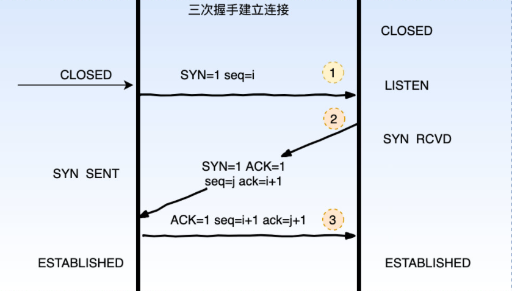
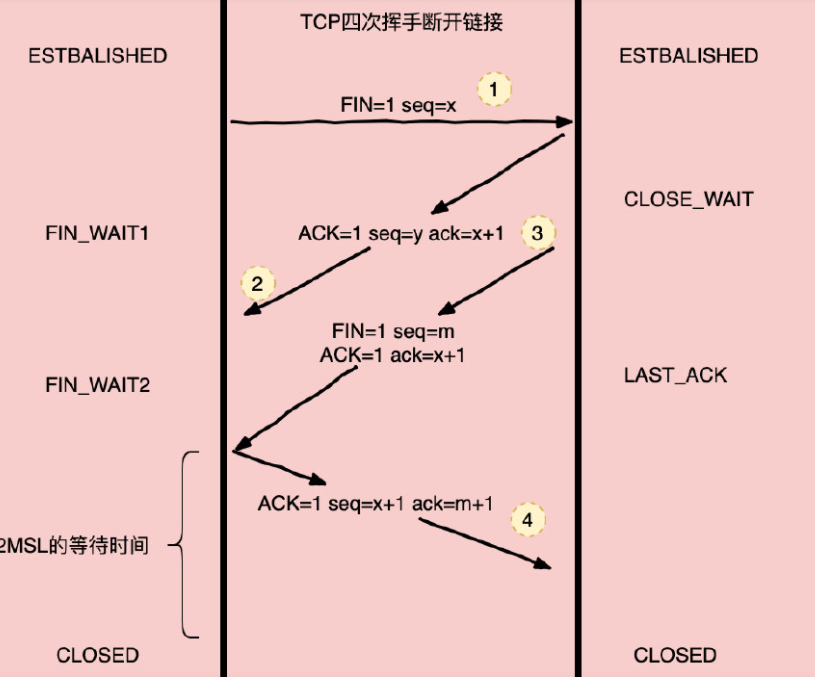

1. HTTP的 三次握手和四次握手 

   > 三次握手建立链接，四次挥手断开链接。

   三次握手

   

   * 第一次：C端发送SYN=1的请求报文，此时C端 进入SYN SENT状态，等待服务器确认。
   * 第二次：S端收到C端发送的SYN 报名（建立连接请求）后，S端必须返回确认好并且同时发送一条SYN报文，此时进入SYN RCVD状态。
   * 第三次: C端收到 S端发的 ACK+SYN报文，需要返回一个应答ACK的报文，此时连接会进入半连接状态的队列，当S端收到ACK后，一条完整的全双工TCP连接建立完成，双方进入 ESTABLISHED状态 。

   四次握手

   

   * 第一次：当C端的应用程序结束数据传输时，会向S端发送一个带有FIN 附加 标记的报文段，此时C端进入FIN_WAIT1状态，C端不能再发送数据到S端 。
   * 第二次：S端收到FIN 报文会响应一个ACK报文，S端进入 CLOSE_WAIT状态。进入此状态后S端把剩余未发送的数据发送到C端，C端收到 S端 的ACK 之后，进入 FIN_WAIT2状态。同时继续接收S端传输的其他 数据包。
   * 第三次：S端处理完自己待发送的数据之后，也会发送FIN断开连接的请求，S端进入LAST_ACK状态。
   * 第四次：C端收到S端的断开连接请求后会启动一个定时器，该定时器时长是2MSL ，同时发送最后一次 ACK 报文。

