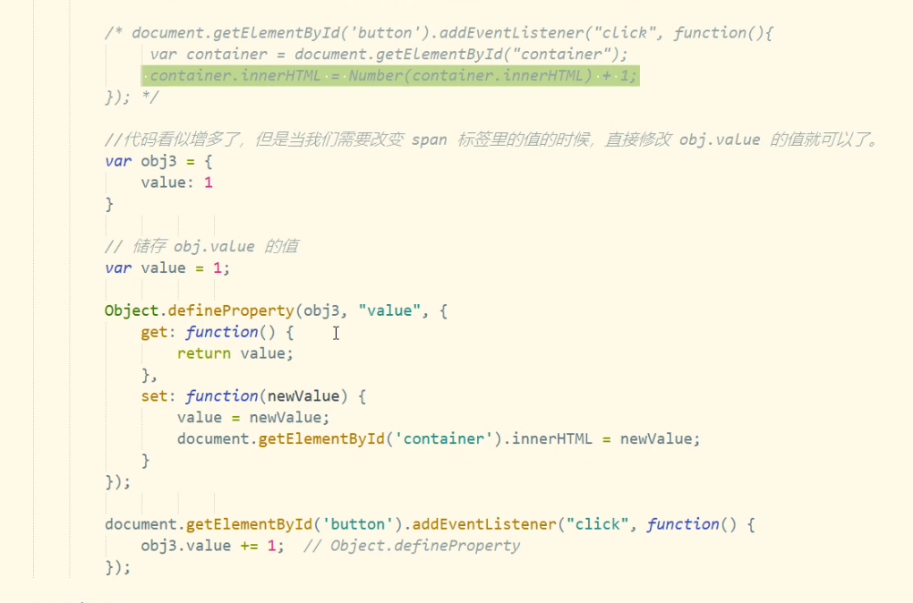
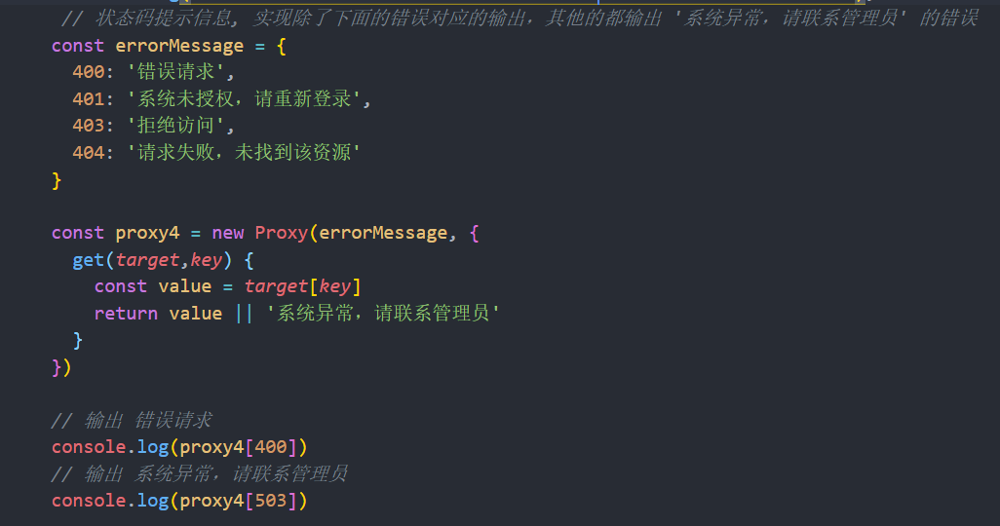
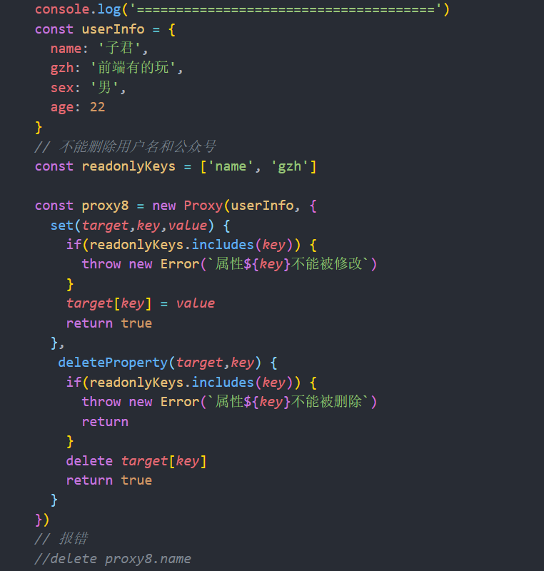

## Vue2.0 

1. Vue的生命周期

   ```js
      var vm = new Vue({
           el: '#app',
           data: {
               message: 'hello world'
           },
           methods: {
               changeMsg () {
                   this.message = 'goodbye world'
               }
           },
           beforeCreate() {
               console.log('------初始化前------')
              
           },
           created () {
               console.log('------初始化完成------')
              
           },
           beforeMount () {
               console.log('------挂载前---------')
               
           },
           mounted () {
               console.log('------挂载完成---------')
              
           },
           beforeUpdate () {
               console.log('------更新前---------')
            
           },
           updated() {
               console.log('------更新后---------')
              
           }
       })
   _________________________________________________-
   
   beforeDestroy 
   Destroy
   ```

2. v-if 和 v-show 的 区别

   * v-show 会把HTML元素先渲染起来，符合条件就显示，不符合条件display就为None ,不显示，但是元素还在那
   * v-if 是真正意义上的条件渲染，浏览器会进行条件判断，true就会再渲染，否则不渲染DOM
   * Vue生命周期 ， 由于**v-if 会重新渲染，所以每次切换一次都会重新走一次生命周期**，v-show 由于只是控制显示隐藏，所以除了初始化渲染，其他时候都不会再走相关生命周期了。

3. created和mounted的区别

   * created **在模板渲染成 html前调用**，主要用来初始化数据 
   * mounted **在模板渲染成html后调用**，通常是初始化页面完成后，再对HTM中的DOM节点进行操作 ，如echarts中，就必须得dom节点加载完后才能进行初始化配置

4. 对Vue中 keep-alive的理解和使用 

   > keep-alive 是Vue内置的一个组件，可以是被包含的组件保留状态，或避免重新渲染，也就是组件缓存

   被包含在<keep-alive> 中创建的组件，会新增两个生命周期的钩子， **activated与 deactivated** 

    activated ：当 keep-alive 包含的组件再次渲染的时候触发

   deactivated ：当 keep-alive 包含的组件销毁的时候触发

5. Vue双向数据绑定原理

   > 其核心是 Object.defineProperty()方法  

   vue.js 则是**采用数据劫持结合发布者-订阅者模式**的方式，通过Object.defineProperty()来劫持各个属性的setter，getter，在数据变动时发布消息给订阅者，触发相应的监听回调。

   但是 Vue2所使用的 Object.defineProperty()方法   只能监听已存在的属性，对于新增删除属性却不可以 而且无法监听数组的变化。 所以Vue3.0   proxy代理  出现了！！ 

   ```js
   let p = new Proxy(target, handler)
   // target 代表需要添加代理的对象
   // handler用来自定义对象中的操作，比如自定义set/get 函数 
   
   ```

   

   

6. Proxy代理 

   > 对目标对象的操作之前提供了拦截，可以对外界的操作进行过滤和改写，修改某些操作的默认行为，

   语法： *const proxy = new Proxy(target, handler)* 

   ```
   target: 要兼容的对象，可以是一个对象，数组，函数等等 
   handler: 是一个对象，里面包含了可以监听这个对象的行为函数。
   handler 里面的方法列表: handler.get  handler.set  handler.has  handler.deleteProterty 
   ```

   

   

7. nextTick 

   > **Vue在观察到数据变化时并不是直接更新DOM，而是开启一个队列，并缓冲在同一事件循环中发生的所有数据改变。**在数据变化后要执行的某个操作，而这个操作需要使用随数据改变而改变的DOM结构的时候，这个操作都应该放进`Vue.nextTick()`的回调函数中。

   实际应用:

   * 在created和mounted 阶段，如果需要操作渲染后的视图，也要使用nextTick方法

     ```
     mounted:function(){
     	this.$nextTick(function(){
     			// 更新数据后，要立即对数据绑定的DOM进行操作，可以把js代码放这里  
     	})
     }
     ```

   * 点击按钮显示原本以 v-show = false 隐藏起来的输入框，并获取焦点。

     ```
     showsou(){
       this.showit = true
       this.$nextTick(function () {
         // DOM 更新了
         document.getElementById("keywords").focus()
       })
     }
     ```

8. .vue 页面级组件之间传值

   * 通过vue-router 跳转链接 带参数传递 
   * 使用本地缓存localStorage 
   * 使用 vuex 数据管理传值。 

9. Vue动态路由匹配

   在 path 属性中 指定路由跳转路径  path: '/user/:id',   一个路径参数 使用 : 标记，当匹配到一个路由时，参数值会被设置到 `this.$route.params`，可以在每个组件内使用。

   ```
   const User = {
     template: '<div>User</div>'
   }
   
   const router = new VueRouter({
     routes: [
       // 动态路径参数 以冒号开头
       { path: '/user/:id', component: User }
     ]
   })
   
   
   const User = {
     template: '<div>User {{ $route.params.id }}</div>'
   }
   ```

10. vue-router有哪几种路由守卫 ？

   * 全局守卫：beforeEach   作用:跳转前进行判断拦截

     ```
     // to.path 进入到哪个路由去， from: 从哪个路由离开  
     // next  函数，决定是否展示你要看到的路由页面。
     
     router.beforeEach((to,from,next)=>{
       if(to.path == '/login' || to.path == '/register'){
         next();
       }else{
         alert('您还没有登录，请先登录');
         next('/login');
       }
     })
     ```

   * 组件内钩子：beforeRouteEnter、beforeRouteUpdate、beforeRouteLeave

   * 单独路由独享组件  beforeEnter 

     

11. $route 和 $ router 的区别是什么 ？

    $router 是vueRouter的实例，是一个全局路由对象，包含了路由跳转，钩子函数等。

    $route 对象表示当前的路由对象，包含了当前URL 解析得到的信息。包括当前的路径，参数，query对象等。如 $route.path   $route.params   $route.query  

12. vue-loader的作用

    **解析和转换.vue文件**。提取出其中的逻辑代码 script,样式代码style,以及HTML 模板template，再分别把他们交给对应的**loader**去处理

    js可以写es6,style样式可以写scss或less、template可以加jade等

13. vue 路由跳转的几种方式

    * 先绑定路由  

      ```vue
      const RouterModel = new Router({
      routes: [
      {
      path: '/cart', name: 'cartTest', meta: {
      keepAlive: true
      },components: {
      default: asyncLoader('cart/shop-cart')
      }
      }
      ]
      });
      ```

    * 不带参数路由跳转 

      ```
      //  name 不带参数 
      <router-link :to="{{name:'cartTest'}}"></router-link>
      // path 不带参数 
      <router-link :to="{{path:'/cart'}}"></router-link>
      ```

    * 带参数路由跳转 

      ```
      // name 带 参 数 params 传 参 数 (类 似post),html 取参 $route.params.id script, 取参 this.$route.params.id
      <router-link :to="{name: 'cartTest', params: {id: 1}}"></router-link>
      
      //name 带参数,query 传参数 (类似 get,url 后面会显示参数),html 取参 $route.query.id, script 取参this.$route.query.id
      <router-link :to="{name: 'cartTest', query: {id: 1}}"></router-link>
      ```

    * this.$router.push( ) 函数内调用

      ```
      不带参数 
      @click="this.$router.push{{name:'cartTest'}}"
      @click="this.$router.push{{path:'/cart'}}"
      @click="this.$router.push{{'/cart'}}"
      带参数
      @click="this.$router.push({name: 'cartTest', params: {id: 1}})"
      @click="this.$router.push({name: 'cartTest', query: {id: 1}})"
      ```

15. v-for中 key 的作用

    * key的作用主要是**为了更高效的对比虚拟DOM中每个节点是否是相同节点；**
    * Vue在patch过程中判断两个节点是否是相同节点，key是一个必要条件，渲染一组列表时，key往往是唯一标识，所以如果不定义Key的话，Vue只能认为 认为 比较的节点是同一个，哪怕他们实际上并不是，这导致了频繁更新元素， 使得整个patch  过程比较低效，影响性能。

16. 何为虚拟DOM ？

    **虚拟dom就是一个普通的js对象**。是一个用来描述真实dom结构的js对象  如 ：

    ```html
    //这段dom元素 可以用js进行模拟   
    <div id="demo" class="box">
            <h1>虚拟DOM</h1>
            <ul style="color:blueviolet">
                <li>第一项</li>
                <li>第二项</li>
                <li>第三项</li>
            </ul>
        </div>
    
    // 结果：
    <script>
        {
            tag: 'div'
            props: {
                id: 'demo',
                className: 'box'
            },
            children: [{
                    tag: 'h1',
                    children: '虚拟DOM'
                },
                {
                    tag: 'ul',
                    props: {
                        style: 'color:orange'
                    },
                    children: [{
                        tag: 'li',
                        children: '第一项'
                    }, {
                        tag: 'li',
                        children: '第二项'
                    }, {
                        tag: 'li',
                        children: '第三项'
                    }, ]
                }
            ]
        }
    </script>
    ```

17. 你怎么理解Vue中的diff算法 ？

    在js中，渲染真实DOM的开销是非常大的，比如我们修改了某个数据，如和直接渲染到真实DOM，会引起整个DOM树的重绘和重排。这时我们就需要**根据真实DOM生成虚拟 DOM，当虚拟DOM的某个节点改变了就生成了一个新的 Vnode，然后新的Vnode和旧的Vnode进行比较，发现有不一样的就直接修改在真实DOM上。然后使旧的Vode的值 为新的Vnode** 

    diff的过程就是patch函数，**比较新旧节点，一边比较一边给真实DOM打补丁**，在采取diff算法比较新旧节点的时候，**比较只会在同层级进行**，在`patch`方法中，首先进行树级别的比较 `new Vnode`不存在就删除 `old Vnode` `old Vnode` 不存在就增加新的`Vnode` 都存在就执行diff更新 当确定需要执行diff算法时，比较两个`Vnode`，包括三种类型操作：属性更新，文本更新，子节点更新 新老节点均有子节点，则对子节点进行`diff`操作，调用`updatechidren` 如果老节点没有子节点而新节点有子节点，先清空老节点的文本内容，然后为其新增子节点 如果新节点没有子节点，而老节点有子节点的时候，则移除该节点的所有子节点 老新老节点都没有子节点的时候，进行文本的替换

18. Vue路由中的# hash模式和history模式 
    * `#` 代表网页中的一个位置，其右面的字符就是该位置的标识符，**在http请求中不会包括#后面的字符**，对后端完全没有影响，因此改变hash不会重新加载页面， 用window.location.hash 读取 
    
* history   没有了 `#` ，操作中不怕 前进和后退，但是就怕刷新，如果没有服务端的支持，**刷新之后就会请求服务端** ，由于找不到相应的支持响应 或者资源，就会报出 404页面 。
  
    * 如何转换成history模式呢？ 很简单，只需要定义router 的时候将 mode改成history 
    
      ```js
      const router =new VueRouter({
      	mode:'history',
      	routes:[...]
      })
      ```
    
      
    
19. Vue如何实现按需加载 配合 webpack 设置 ？

    * Vue-router 配置 resolve + require 加载   （Vue异步组件技术）

      ```
      {
          path: '/promisedemo',
          name: 'PromiseDemo',
          component: resolve => require(['../components/PromiseDemo'], resolve)
      }
      
      ```

    * es6的import方法  （vue的路由懒加载）

      ```
      //下面2行代码，指定了相同的webpackChunkName，会合并打包成一个js文件。
      const ImportFuncDemo = () => import(/* webpackChunkName: 'ImportFuncDemo' */ '../components/ImportFuncDemo')
      const ImportFuncDemo2 = () => import(/* webpackChunkName: 'ImportFuncDemo' */ '../components/ImportFuncDemo2')
      export default new Router({
          routes: [
              {
                  path: '/importfuncdemo1',
                  name: 'ImportFuncDemo1',
                  component: ImportFuncDemo1
              },
              {
                  path: '/importfuncdemo2',
                  name: 'ImportFuncDemo2',
                  component: ImportFuncDemo2
              }
          ]
      ```

    * webpack提供的 resolve + **require.ensure()** 多个路由指定相同的chunkName，会合并打包成一个js文件。

      ```
      {
          path: '/promisedemo',
          name: 'PromiseDemo',
          component: resolve => require.ensure([], () => resolve(require('../components/PromiseDemo')), 'demo')
      },
      {
          path: '/hello',
          name: 'Hello',
          component: resolve => require.ensure([], () => resolve(require('../components/Hello')), 'demo')
      }
      //这两个路由最终会打包成一个demo.js文件
      
      ```

20. 什么是Vue的计算属性  ？
    * 对数据进行复杂处理，且多次使用的情况下选用计算属性
    * 计算属性内部  this 指向 vm实例 
    * 在 template 调用 时，直接写计算属性名即可。
    * 常用的是 getter方法，获取数据，也可以使用 set方法改变数据 
    * 相较于,methods , 不管依赖的数据变不变，methods 都会重新计算，但是依赖数据不变的时候，computed 从缓存中 读取，  不会重新计算 

21. vm.$el 、 vm.$options  、 vm.$options.data().message   vm.$refs 

    * vm.$el   Vue实例使用的根 DOM 元素 
    * vm.$options  包含了 实例的 属性  和 方法 
    *  vm.$options.data().message   表示 data对象里面的 message属性  与vm.$data 一样
    * vm.$refs  对子组件进行 引用 拿到 属性方法 

22. SPA单页面应用的优缺点

    > 仅在 Web 页面初始化时加载相应的 HTML、JavaScript 和 CSS。一旦页面加载完成，SPA 不会因为用户的操作而进行页面的重新加载或跳转；取而代之的是利用路由机制实现 HTML 内容的变换，UI 与用户的交互，避免页面的重新加载。

    优点：

    * 用户体验好，快，内容的改变不需要重新加载整个页面，避免了不必要的跳转和渲染  ，减轻服务器压力
    * 前后端指责分离，架构清晰，前端进行交互逻辑，后端负责数据处理

    缺点:

    * **初次加载耗时多**，为了实现单页Web应用功能及显示效果，需要在加载页面的时候将 js css 统一加载，部分页面按需加载，但是转场动画快
    * **不能使用 前进后退功能**， 所有的页面切换需要自己建立堆栈管理
    * **SEO难度大** 

23. Vue的常规修饰符

    * .stop 可阻止事件冒泡 
    * .prevent 可阻止事件的默认行为 
    * capture 可捕获内部事件并先处理，再由内部事件处理
    * .once 只触发一次事件
    * .self 只有当前事件才触发，可用于父组件事件阻止冒泡行为
    * .passive 提前告知浏览器该事件没有被阻止，优化移动端触屏性能。

24. watch 和 computed 区别 

    * watch  中的函数是不需要调用的  computed 内部的函数调用的时候不需要加（）
    * watch 属性监听，监听属性的变化，computed 计算属性  通过计算而得来的属性
    * 当需要在**数据变化的时候执行异步或者开销比较大的操作**时，一般用watch属性，而computed不支持异步 。
    * computed 支持缓存，只有依赖数据发生变化，才会重新进行计算 ，watch不支持缓存 。
    * computed 可以函数依赖很多值，但是watch只能依赖一个值。

25. pwa 是什么？

    > 渐进式网页，能确保每个用户都能打开网页响应式，PC、手机、平板、不管哪种格式，网页格式都能完美适配 

     特性：

    * 离线应用：支持用户在没网的条件下也能打开网页，这里就需要 server worker的帮助
    * APP 化 ： 能够像APP一样和用户进行交互
    * 常更新：一旦web网页有什么改动，都能立即在用户端体现出来
    * 安全：安全第一，给自己的网站加上一把绿锁 https
    * 可搜索：能够被引擎搜索到 
    * 推送 ： 做到在不打开网页的前提下，推送新的消息 
    * 可安装：能够将web像app一样 添加到 桌面 
    * 可跳转：只要通过一个连接就可以跳转到 你的 web页面 

26. iframe 的优缺点 ？

    > iframe 也称 嵌入式框架，它可以把一个网页的框架和内容嵌入在现有的网页中

    优点：

    * 解决 加载缓慢的第三方内容如 图标和广告等的加载问题
    * 方便制作导航栏
    * 模板分离，便于更改，如果有多个网页引用iframe，只需要修改iframe的内容，就可以实现调用的每一个页面内容的更改，方便快捷 。

    缺点：

    * iframe会阻塞主页面的Onload事件 
    * 即使内容为空，加载也需要时间 
    * 多数小型的移动设备（PDA 手机）无法完全显示框架，设备兼容性差。

27. vue与react的异同

    **相同点**

    * 都支持组件化和虚拟DOM
    * 都支持 **props** 进行父子组件通信
    * 都支持数据驱动视图，不支持操作  真实DOM 更新状态视图自动更新 
    * 都支持服务端渲染 

    **不同点**

    * **设计思想不同，Vue是 MVVM ，而React是 MVC** 
    * vue数据双向绑定，react数据单向绑定
    * 组件写法不同。**react推荐 jsx 写法**，即把html和 css都写进 js ； vue推荐 webpack+vue-loader 的单文件组件格式，把html css  js 都写进同一个文件 
    * state对象在react中 是不可变的，需要使用setState方法更新状态，而vue中，state不是必须的，数据由data在vue对象中管理。
    * 虚拟DOM不一样，vue会跟踪每一个组件的依赖关系，不需要重新渲染整个组件树，而react每当应用状态改变时，全部组件都会重新渲染，所以react 需要**shouldComponentUpdate**这个生命周期方法来进行控制。

28. 组件data为什么要用函数 ？

    vue组件中data值不能为对象，因为**对象是引用类型**，组件可能会被多个实例同时引用，如果data值为对象，将导致多个实例共享一个对象，当一个组件改变其data值时，其他实例也会受到影响。

    只有当 data为 函数时，通过**return  返回对象的拷贝**，致使每个实例都有自己独立的对象， 实例之间可以互不影响的改变data属性值  。

29. 对比jQuery, Vue有什么不同 ？

    **jQuery 专注视图层，通过操作DOM去实现页面的一些逻辑 渲染**;Vue专注于数据层，通过数据的双向绑定，最终表现在DOM层面，减少了DOM 操作。

    Vue 使用了组件化思想，使得项目子集职责清晰，提高了开发效率，便于重复利用，协同开发。

30. v-if 与 v-for 为什么不建议一起使用 ？

    **v-for 优先级要高于 v-if**  ,如果两者同时存在，那v-for每次循环的时候 都需要进行 v-if 进行判断， 影响性能。

    解决方法： 在for 循环 外面 写一层 template , 然后用v-if 进行判断是否执行 

31. Vue中的 errorHandler

    指定组件的渲染和观察期间未捕获错误的处理函数。这个处理函数被调用时，可获取错误信息和 Vue 实例。

    ```
    Vue.config.errorHandler = function (err, vm, info) {
      // handle error
      // `info` 是 Vue 特定的错误信息，比如错误所在的生命周期钩子
      // 只在 2.2.0+ 可用
    }
    ```

    捕获组件生命周期钩子里的错误 捕获 Vue 自定义事件处理函数内部的错误了 捕获 `v-on` DOM 监听器内部抛出的错误

## Vue3.0

### Vue3.0的生命周期

```js
setup() 替代

beforecreate -> use setup()
created -> use setup()
————————————————————————————————————————————————
前面加on

beforeMount -> onBeforeMount
mounted -> onMounted
beforeUpdate -> onbeforeUpdate
updated -> onUpdated
activated -> onActivated
deactivated -> onDeactivated
errorCaptured -> onErrorCaptured
————————————————————————————————————————————————
更改名称

beforeDestroy -> onBeforeUnmount
destroyed -> onUnmounted

新加入

onRenderTracked
onRenderTriggered
主要用于开发阶段调试使用
————————————————
```

### Vue3的新特性

* Composition API   可以提高代码逻辑的可复用性，从而实现与模板的无关性，同时使代码的可压缩性更强。
* 更好的 `TypeScript` 支持 
* 在性能方面比 Vue2 快2倍，重写了虚拟DOM的实现
* `Tree-shaking support`  对使用到的功能或特性进行打包（按需打包）  

