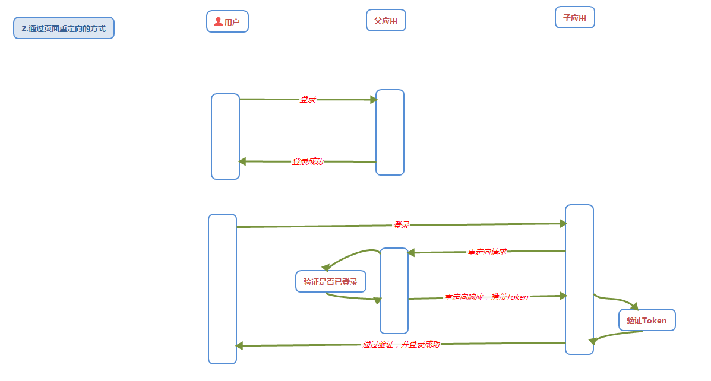

## webpack的打包原理

> Webpack是一个前端资源加载/打包工具，它将根据模块的依赖关系进行静态分析，然后将这些资源按照指定的规则生成静态资源。

注意：Webpack 本身只能处理 JavaScript 模块，如果要处理其他类型的文件，就需要使用 loader 进行转换。

### webpack核心概念

1. entry:  一个可执行模块或库的入口文件
2. output:  告诉webpack在哪里输出它所创建的bundles以及如何命名这些文件
3. module: 模块，在webpack里一切皆模块，一个模块对应着一个文件 
4. chunk: 多个文件组成的一个代码块，例如把一个可执行模块和它所有依赖的模块组成一个chunk.体现了webpack的打包机制
5. loader: 文件转换器，例如把es6转换成es5  scss 转换成css
6. plugin: 插件，用于扩展webpack的功能。

### webpack的作用

1. 模块打包。可以将不同模块的文件打包整合在一起。并且保证他们之间的引用正确，执行有序。
2. 编译兼容。 通过`webpack`的`Loader`机制进行编译转换诸如`.less, .vue, .jsx`这类在浏览器无法识别的格式文件。更好的兼容
3. 能力扩展。通过webpack的`plugin`机制，我们在实现模块化打包和编译兼容的基础上，进行实现诸如按需加载，代码压缩等一系列功能。

### webpack的打包运行原理？

1. 读取`webpack`的配置参数
2. 启动webpack,创建`Compiler`对象并开始解析项目；
3. 从入口文件`entry`开始，并且找到其导入的依赖模块，递归遍历分析，形成依赖关系树；
4. 对不同文件类型的依赖模块文件使用对应的`Loader`进行编译，最终转为js文件；
5. 整个过程中webpack会通过`发布订阅模式`，向外抛出一些 `hooks`，而`webpack`的插件即可通过监听这些关键的事件节点，执行插件任务进而达到干预输出结果的目的。

### webpack的热更新

1. **是什么？**

   HMR，可以理解为热替换，指在**应用程序运行过程中，增删改模块的时候，无需重新刷新整个应用。**

   在webpack配置开启热模块 ：

   ```js
   const webpack = require('webpack')
   module.exports = {
     // ...
     devServer: {
       // 开启 HMR 特性
       hot: true
       // hotOnly: true
     }
   }
   ```

   上方的简单配置只会引起 css变动时执行热更新，但是js文件并不起作用。需要详细的配置 ：

   ```js
   if(module.hot){
       module.hot.accept('./util.js',()=>{   //  module.hot.accept
           console.log("util.js更新了")
       })
   }
   ```

2. **实现原理**

   

   `Server`端使用`webpack-dev-server`去启动本地服务，内部实现主要使用了`webpack`、`express`、`websocket`。

   * 使用`express`启动本地服务，当浏览器访问资源时对此做响应。
   * 服务端和客户端使用`websocket`实现长连接
   * `webpack`监听源文件的变化，即当开发者保存文件时触发`webpack`的重新编译。
     - 每次编译都会生成`hash值`、`已改动模块的json文件`、`已改动模块代码的js文件`
     - 编译完成后通过`socket`向客户端推送当前编译的`hash戳`
   * 客户端的`websocket`监听到有文件改动推送过来的`hash戳`，会和上一次对比
     - 一致则走缓存
     - 不一致则通过`ajax`和`jsonp`向服务端获取最新资源
   * 使用`内存文件系统`去替换有修改的内容实现局部刷新


## 单点登录和多点登录

### 单点登录

> SSO单点登录概念：在一个多系统共存的环境下，用户在一处登录后，就不用在其他系统中登录。

SSO一般都需要一个独立的认证中心（passport），子系统的登录均得通过passport，子系统本身将不参与登录操作，当一个系统成功登录以后，passport将会颁发一个令牌给各个子系统，子系统可以拿着令牌会获取各自的受保护资源，为了减少频繁认证，**各个子系统在被passport授权以后，会建立一个局部会话，在一定时间内可以无需再次向passport发起认证**。

**需解决的问题：**

1. 解决如何产生和存储信任
2. 系统如何验证这个信任的有效性

解决方案：

1. **以Cookie作为凭证媒介，通过JSONP实现**
   用户登录父应用系统后，跟Session匹配的Cookie会存到客户端中，当用户登录子应用系统时，**授权应用访问父应用提供的JSONP接口，并在请求中**
   **带上父应用系统域名下Cookie，**父应用接收到请求，验证用户的登录状态，
   如果登录中则返回加密信息，子应用通过解析返回加密信息验证，验证通过则登录成功子应用系统
   如果不是登录中则返回重新登录页面
2. 通过页面重定向的方式
   通过父应用和子应用来回重定向进行通信实现信息安全传递。**父应用提供一个GET方式登录接口，用户通过子应用重定向连接方式访问这个接口**。如果用户还没有登录则返回登录页面，
   如果用户登录了则生成加密的Token并且重定向到子应用提供验证Token的接口，通过解密校验后，登录当前用户

### 多点登录 

> 同一账号可以在不同终端同时登录，同时收发信息。例如PC端微信和手机微信同时登录。

多点登录限制（禁止用户多点在线）： 一个端同一个账号只能登录一个实例，例如一个账号在网站端登录后，后一个人使用这个账号在网站端 登录，前一个人会被挤下去并会收到通知：“你已在别处登录.. " 

## 图片加载优化

1. 不用图片，能用css代替一些修饰类图片则代替
2. 对于移动端来说，图片质量要求不高，可以把图片放到CDN加载，可以计算出适配屏幕的宽度，然后去请求响应裁剪好的图片
3. 小图使用`base64`格式
4. 将多个图标文件整合到一张图片   `background` 定位访问图标
5. 选择正确的图片格式;
   * 对于能够显示`WebP`格式的浏览器尽量使用 WebP格式。因为WebP格式具有更好的图片压缩算法。能带来更小得图片体积。
   * 小图使用`PNG` , 图标之类的可以用SVG来代替
   * 照片使用`JPEG`

## 其他文件优化

1. css文件放在 `head` 中 
2. 服务端开启文件压缩功能。 webpack vue-cli 
3. 将`script` 标签放在`body`底部，因为js文件执行会阻塞渲染。当然也可以把script标签放在任意位置然后加上`defer` ，表示该文件会并行下载。
4. 执行JS代码过长会卡住渲染，对于需要很多时间计算的代码可以考虑用 `WebWorker`。它可以让我们**另开一个线程执行脚本 而不影响渲染**。

## 使用GZIP压缩

> GZIP是网站压缩加速的一种技术，对于开启后可以加快我们网站的打开速度。经过服务器压缩，客户端浏览器快速解压，可以大大减少网站的流量。

## 项目上线优化

具体可以看 **后天管理系统文档**

1. 生成打包报告
2. 第三方库启用CDN
3. Element-UI 组件按需加载
4. 路由懒加载
5. 首页内容定制

## MySQL 内联、左联、外联的区别 

> 在关系型数据库中如Mysql中，我们有时需要多表查询，从多个表中提取数据， 你可以用SELECT, UPDATE 和 DELETE 语句中使用 Mysql 的 JOIN 来联合多表查询。

JOIN按照功能大致分为如下三类：

1. INNER JOIN 内连接 ： 获取两个表中字段匹配关系的记录。
2. LEFT JOIN（左联）：先返回左表的所有行，再加上符合连接条件的匹配行
3. RIGHT JOIN（右联）：先返回右表的所有行，再加上符合连接条件的匹配行

### INNER JOIN

> **仅将两个表中满足连接条件的行组合起来作为结果集。** 

格式：  SELECT 列名表 FROM 表名1 [INNER] JOIN 表名2 ON或WHERE 条件表达式 


### LEFT JOIN

>会读取左边数据表的全部数据，即便右边表无对应数据。

格式：  SELECT 列名表 FROM 表名1 LEFT JOIN 表名2  ON 条件表达式 


### RIGHT JOIN

>会读取右边数据表的全部数据，即便左边边表无对应数据。

格式： SELECT 列名表 FROM 表名1 LEFT JOIN 表名2  ON 条件表达式 


## 权限控制

### 权限的分类

后端权限

> 权限的核心在于服务器中的数据变化，所以后端才是权限的关键，后端权限可以控制某个用户是否能够查询数据，是否能够修改数据等操作。

* 后端如何知道该请求是从哪个用户发过来的

  ```
  cookie 
  session 
  token 
  ```

* 后端的权限设计 RBAC 

  ```
  用户 角色 权限 
  ```

前端权限

> 本质上控制前端的视图层的展示和前端所发送的请求 

### 前端权限控制思路

1. 菜单的控制

   在登录请求中， 会得到权限数据， 当然， 这个需要后端返回数据的支持． 前端根据权限数据， 展示对应的菜单． 点击菜单， 才能查看相关的界面

2. 界面的控制

   如果用户没有登录， 手动在地址栏敲入管理界面的地址， 则需要跳转到登录界面

   如果用户已经登录， 如果手动敲入非权限内的地址， 则需要跳转404 界面

3. 按钮的控制

   在某个菜单的界面中， 还得根据权限数据， 展示出可进行操作的按钮，比如删除， 修改， 增加

4. 请求和响应的控制

   如果用户通过非常规操作， 比如通过浏览器调试工具将某些禁用的按钮变成启用状态， 此时发的请求， 也应该被前端所拦截

### 实现步骤

1. 权限菜单控制

   用户登录之后服务端返回一个数据，这个数据有菜单列表和`token`，我们把这个数据放入到`vuex`中，然后主页根据`vuex`中的数据进行菜单列表的渲染

   * 前端用户登录服务器返回的数据 带有 rights 数据 

   

   

   * 将数据 保存到 Vuex 以便多个组件之间共享  权力 数据  

     

   * 拿到数据给  Vuex的 state     `this.$store.commit('rightList',res.data)`

   **问题：** 刷新界面`vuex`数据消失，菜单栏消失

   **解决：** 将数据存储在`sessionStorage`中，并让其和`vuex`中的数据保持同步		

   * 

   * 登出要清空sessionStorage 以及 刷新页面清空 Vuex 

     

2. 界面的控制

   **Vue的导航守卫**可以防止跳过登录界面

   ```js
   router.beforeEach((to,from,next)=>{
     // to 将要访问的路径
     // from  代表从哪个路径跳转而来
     // next 是一个函数，表示放行 
     if(to.path === '/login')  return next()
     // 获取token
     const tokenStr= window.sessionStorage.getItem('token')
     if( !tokenStr ) return next('/login')
     next()
   })
   ```

   **动态路由**可以让不具备权限的界面的路由规则压根就不存在 

   * 先把children 下的路由提取出来。
   * 从服务端返回的数据中提取出用户的权限 ，然后进行匹配push到 路由的 routes中  

3. 按钮控制

   路由规则中可以增加路由元数据meta

   通过路由对象可以得到当前的路由规则，以及存储在此规则中的meta数据

   自定义指令可以很方便的实现按钮控制

4. 请求和响应控制

   请求拦截器和响应拦截器的使用

   请求方式约定restful 

## 后端的技术有哪些？

1. 数据库
2. 增删改查更新基本语句，数据库多表查询
3. 缓存技术
4. 负载均衡技术
   1. CDN
   2. HTTP重定向
   3. 基于DNS的轮询解析
   4. 反向代理服务器