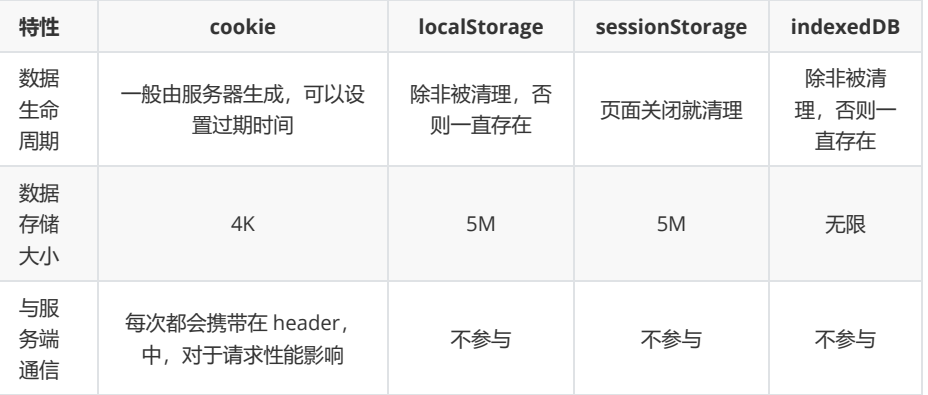

## 浏览器存储的方式有哪些？

补充：cookie 原本并不是用来存储的，而是用来与服务端通信的，需要存取请自行封装api。而 localStorage 则自带 getItem 和 setItem 方法，使用很方便。

localStorage 注意点：
1. **localStorage 只能存字符串**，存取 JSON 数据需配合 JSON.stringify() 和 JSON.parse()
2. 遇上禁用 setItem 的浏览器，需要使用 try...catch 捕获异常

## 浏览器内核的理解

* 主要分为两个部分：**渲染引擎、js引擎**
* 渲染引擎： 负责取得网页的内容 （html、css、img）输出到显示器
* js 引擎：解析和执行 javascript 来实现网页的动态效果 
* IE ： trident内核  
* safari : webkit 内核 
* Chrome : **Blink** （基于webkit）

## HTTP 状态码

* **1XX：信息状态码**
  	100 continue 继续，一般在发送 post 请求时，已发送了 http header 之后服务端将返回此信息，表示确认，之后发送具体参数信息
* **2XX：成功状态码**
  200 ok 正常返回信息
  201 created 请求成功并且服务器创建了新资源
  202 accepted 服务器已经接收请求，但尚未处理
* **3XX：重定向**
  301 move per 请求的网页已经永久重定向
  302 found 临时重定向
  303 see other 临时冲重定向，且总是使用get请求新的url
  304 not modified 自从上次请求后，请求的网页未修改过
* **4XX：客户端错误**
  400 bad request 服务器无法理解请求的格式，客户端不应当尝试再次使用相同的内容发起
  请求
  401 unauthorized 请求未授权
  403 forbidden 禁止访问
  404：not found 找不到如何与url匹配的资源
* **5XX：服务器错误**
  500 internal server error 最常见的服务器端的错误
  503 service unacailable 服务器端暂时无法处理请求（可能是过载活维护）

## 请你谈谈Cookie的优缺点

优点：

* 数据的持久性
* 可配置到期规则。控制cookie的生命期，使之不会永远有效。
* 简单性，基于文本的轻量结构 
* 不需要任何服务器资源。Cookie 存储在客户端并在发送后由服务器读取。

缺点：

* Cookie的数量和长度限制。
* 潜在的安全风险。 Cookie可能被拦截、篡改、如果cookie被拦截，就有可能取得session信息。
* 用户配置为禁用 。有些用户禁用了浏览器或客户端设备接受 cookie 的能力，因此限制了这一功能。

## cookies,sessionStorage和 localStorage 的区别 

* cookie是网站为了标示用户身份而存储在用户本地终端上的数据 
* cookie 数据始终在同源的http请求中携带，会在浏览器和服务器之间来回传递
* sessionStorage和localStorage 不会自动把数据发给服务器，仅在本地保存。
* cookie 数据大小不能超过 4k，但是sessionStorage和 localStorage 的大小可达5M
* localStorage存储持久数据，浏览器关闭后不会丢失除非主动删除
* sessionStorage 数据在浏览器关闭窗口后会自动删除
* cookie 设置的cookie 过期时间之前一直有效，即使窗口关闭。

## GET和POST 的区别 

* **get参数通过url传递，post放在body中**
* **get请求在url中传递的参数是有长度限制的，而post没有。**
* **get请求会被浏览器主动cache,而post不会。**
* **get比post更不安全，因为参数会直接暴露在url中 。** 
* get 产生一个TCP数据包，post产生两个TCP数据包 对于Get请求，浏览器会把http的 header 和 data 一并发送出去，服务器响应 200（返回数据），而对于post ，浏览器会先发送 header , 浏览器会响应100 continue , 浏览器再发送data ，服务器响应200  ok

## 什么是 reflow ? 

浏览器为了重新渲染部分或整个页面。重新计算页面元素位置和几何结构的进程叫做 reflow 回流. reflow 是导致DOM 脚本执行效率吧低的关键因素之一，页面上任何一个节点触发了reflow，会导致他的子节点及 祖先节点重新 渲染。 

简单理解就是: **当元素改变的时候，将会影响文档内容或结构，或元素位置。**

什么时候会导致其发生呢?   改变窗口大小、文字大小、内容改变，操作class属性、脚本操作DOM 、设置style属性 等等 

## 为什么利用多个域名来存储网站资源会更有效？

* CDN 缓存更方便

  >CDN：是构建在网络之上的内容发布网络，依靠部署在各地的边缘服务器，通过中心平台的负载均衡、内容发布、调度等功能模块，是用户就近获取所需内容，降低网络拥塞，提高用户访问响应速度和命中率。CDN的关键技术主要是内容存储和分布技术。简单来说，**CDN主要用来使用户就近获取资源**

* 突破浏览器并发限制

  >同一时间针对同一域名下的请求有一定数量限制，超过限制数目的请求会被阻塞。大多数浏览器的并发数量都控制在6以内。有些资源的请求时间很长，因而会阻塞其他资源的请求。因此，对于一些静态资源，如果放到不同的域名下面就能实现与其他资源的并发请求。

  

* 节约cookie带宽

* 节约主域名的连接数，优化页面响应速度
* 防止不必要的安全问题

## 浏览器从输入url 到渲染页面，发生了什么 ？

网络部分：

* 构建请求
* 查找强缓存
* DNS解析
* 建立TCP连接 （三次握手） => 发生HTTP请求 ，网络请求后网络响应

浏览器解析部分：

* 解析html构建 DOM树
* 解析css构建css树，样式计算
* 生成布局树 （layout Tree）

浏览器渲染部分：

* 建立图层树 
* 生成绘制列表
* 生成图块并栅格化
* 显示器显示内容 
* 最后断开连接，TCP四次握手 

## http1.0、http1.1、http2.0的区别

* 1和1.0相比，1.1可以一次传输多个文件，增加HOST字段，支持断点传输，以及 缓存处理  如 cache-control
* http1.x解析基于文本，http2.0采用二进制格式，新增特性 多路复用、header压缩、服务端推送(静态html资源)